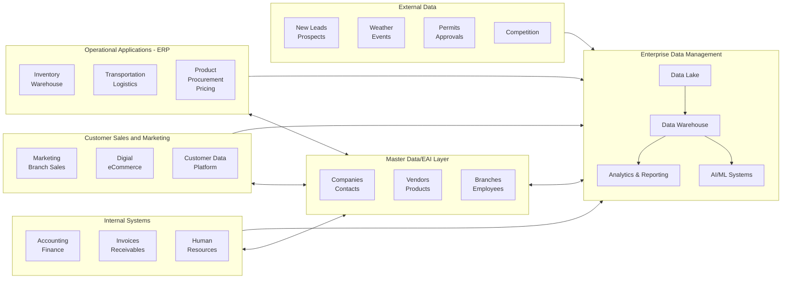
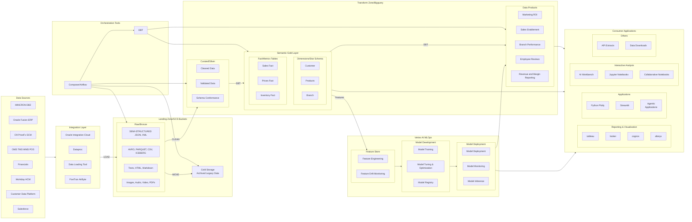
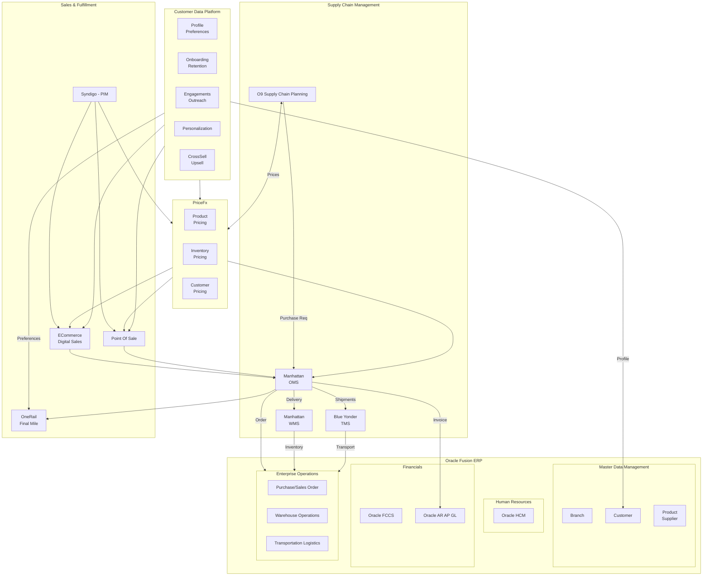
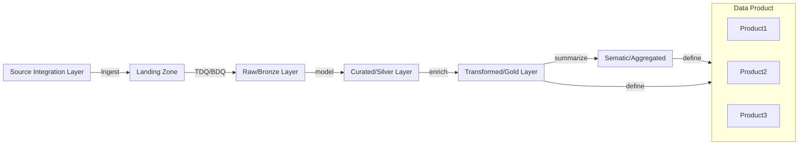

## Logical Architecture

-------------------------------------------------------------------------------------------------------
#### Lakehouse Internal Architecture

-------------------------------------------------------------------------------------------------------
### Conceptual Dataflow captured without Data Integration Middleware

---------------------------------------------------------------------------------------------
### Conceptual Data processing in Lakehouse

