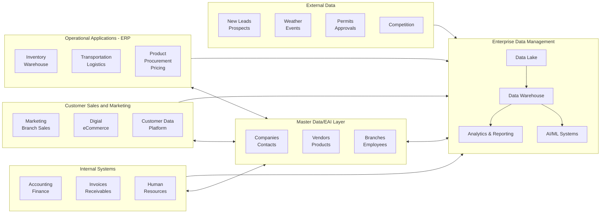
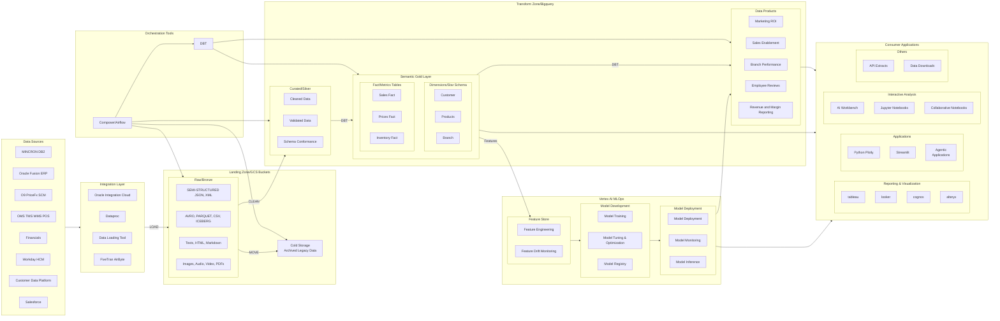

## Enterprise Architecture

The following diagram describes proposed enterprise system architecture. 

- Diagram shows a set of systems & processes that are operational and others that are analytical in nature. 
Operational systems do have analytics capabilities

- When operations spread across systems, it is unavoidable to have some functional dependencies on what is 
happening in other systems. This creates a need for robust and timely data sharing.  

- Logging of the transactions and activities happen in all operational systems to support this. 
The data in these logs are also the source for all the tracking and reporting created in analytic processes

- Master data: Consists of maintaining a list of known entities like customers, vendors, branches, products etc. 
This doesnot change frequently like transactions but nevertheless latest updates needs to be maintained and actively 
shared with all applications, operational and analytics alike, as all transactions are linked to them.  

- In Beacon, mincron was the do-it-all application with long tail of systems supporting the missing functionality. 
This nearly monolithic solution minimized the data exchange needs so a mature data sharing mechanism was never developed

- When we modernize, this will not work. The solutions we are looking at are more sophisticated and specialized, 
and whether we build or buy, will be more modular and will require a very mature Enterprise Application Integration (EAI) strategy 

## Logical Architecture

-------------------------------------------------------------------------------------------------------
#### Lakehouse Internal Architecture

-------------------------------------------------------------------------------------------------------
#### Warehouse design goals 
- Only focuses on what needs to be built on top of any platform we decide to use. 
- Business goals  
    - Provide data as single source of truth for various consumers across the organization 
    - Scale BI/AI functions - Analysis/Reporting for tracking, knowledge, insights and intelligence  
    - Create schema consistency and standardization for self-service BI capabilities
    - Stitch data from external/internal sources for augmenting operational (leads) 
        and analytic (forecasting) capabilities 
    - Consolidate data from multiple potential business aquisitions for unified analysis, 
        reporting and consumption purposes
    - Enable systematic historical data integration for timeseries and cross sectional analysis

- Technical goals
    - Create functional abstraction based data model and supporting API led ingestion process 
    - Support multiple forms of ingestion as well as consumption - Batch/Realtime and Snapshot/Incremental
    - Datamodel driven quality checks and governance in addition to TDQ, BDQ  
    - Implementing reliable entity management supported by static, universal, non-recycled keys 
    - Handling key splits and merges with historical and ongoing data consistency  
        - Use of surrogate warehouse keys to decouple from operational systems dependency 
    - Proper change data capture (CDC) strategy to store continious history 
    - Ensuring a managed and controlled ecosystem with 
        - Action/state consistency 
        - Leave no change untracked 
            - Incremental Write-ahead with no overwrites
            - History on both data/schema evolution
            - No data without metadata policy 

- System Integration goals
    - One of our known strategies is to grow the business through integrations and aquisitions
    - Design for keeping **data/analytics integrations decoupled from operational integration** so both can happen in parallel. 
    - Huge boost our effectivess as it will accelerate the knowledge gathering exercise for the executive management team during M&A

- Having a Data model that not too Beacon centric but based on abstraction of business functions in more generalized terms
- Time travel support and capture of continious history (not just snapshots)
- Support for incremental and full feature recomputes
-------------------------------------------------------------------------------------------------------
#### Modern data warehouse - Platform features
- Cloud-Native and Scalable
    - Elastic Scalability: Automatically scales compute and storage independently, often with near-infinite capacity.
    - Pay-as-you-go: Charges based on usage—no need to provision hardware.

- Multi-cloud / Hybrid Support: 
    - Enables deployment across multiple cloud providers and on-premise environments.

- Separation of Compute and Storage
    - Decoupled Architecture: Allows scaling compute resources without moving or duplicating data.
    - Parallel Processing: Distributed engines can query vast amounts of data in seconds.

- Support for Semi-Structured and Unstructured Data
    - Flexible Data Ingestion: Supports JSON, Avro, Parquet, ORC, XML, etc.

- Unified Storage Layer 
    - Can process both structured (SQL) and semi/unstructured data from the same platform.

- Integrated Data Lake and Lakehouse Capabilities
    - Converged Architecture: Modern warehouses often integrate or coexist with data lakes, 
    - forming lakehouse solutions (e.g., Databricks, Snowflake).

- Support Open Formats: Support for Delta Lake, Iceberg, or Apache Hudi for
  managing large-scale, versioned data.

- Strong Security and Governance
    - End-to-End Encryption: Both at rest and in transit.

- Granular Access Control: 
    - Role-based access, row-level and column-level security.

- Data Lineage and Auditing: 
    - Tracks where data comes from, how it's transformed, and who accessed it.

- Real-Time and Streaming Capabilities
    - Low-Latency Ingestion: Can ingest and query streaming data (e.g., via Kafka, Pub/Sub).
    - Change Data Capture (CDC): Supports real-time updates via tools like Debezium or built-in CDC features.

- Built-In Machine Learning and Analytics
    - ML Integration: Connects seamlessly with ML frameworks or offers built-in ML (e.g., BigQuery ML, Redshift ML).
    - Advanced Analytics: Supports time-series, geospatial, and predictive analytics directly via SQL or APIs.

- Serverless or Managed Infrastructure
    - Fully Managed Services: Reduces operational overhead—no manual patching or tuning.
    - Auto Tuning: Optimizes performance automatically based on workload patterns.

- Robust Data Integration and ETL/ELT Tools
    - ETL/ELT Integration: Compatible with modern data pipeline tools (Fivetran, dbt, Airflow).
    - In-database Transformations: Enables ELT-style workflows directly within the data warehouse.

- Support for SQL and Beyond
    - SQL-first Interfaces: Core support for SQL, but also extensible to Python, R, or other languages.
    - BI Tool Compatibility: Integrates natively with Looker, Tableau, Power BI, etc.
---------------------------------------------------------------------------------------------------------
#### GCP Data platform - Databricks like feature Parity
- Google Cloud Storage
    - Data Lakehouse Storage for raw/curated data lake storage
- BigQuery
    - Interactive analytics and warehousing
    - Can push unaccessed history data seamlessly to low-cost storage
    - Streaming inserts for changing data while supporting concurrent queries
- BigTable
    - OLTP, persistent cache for concurrent latest data in analytics 
- Dataproc - Managed Spark/Big Data Compute Dataproc.
    - Fully managed Spark, Hadoop, and other open-source tools 
    - for batch and streaming workloads.
- Cloud Composer (Airflow)
    - Data Workflow orchestration for ETL pipelines.
    - DBT - SQL with CICD/Testing  
- Data Streaming
    - Pub/Sub - Real-time messaging (Pub/Sub)
- Dataflow - stream/batch processing.
    - Machine Learning Lifecycle
- Vertex AI 
    - Unified ML platform for training, deploying, and managing models.
- Collaborative Notebooks
    - Vertex AI Workbench or Colab Enterprise
    - Managed Jupyter notebooks for team collaboration and development.
- Data Integration/ETL
    - Cloud Data Fusion or Dataprep Visual ETL and data preparation pipelines.
- Data Governance & Catalog
    - Dataplex - Governance, cataloging, and policy enforcement for lakes and warehouses.
- BI & Visualization
    - Looker - Business intelligence, dashboards, and visualization
---------------------------------------------------------------------------------
#### Tactical Work 
- Centralizing MDM - Customer and Product Data stitching: 
    - In-progress solutions
        - Ashwin methodology (Veracity)
        - Syndigo methodology
        - Mackensey methodology
        - Tiger methodology (Lead enrichment pipeline)
    - Need validation framework 
    - Continous process and absorbing revisions? 
    - Cleanup plan for existing data 
    - Prevention plan for further data screwups
---------------------------------------------------------------------------------
