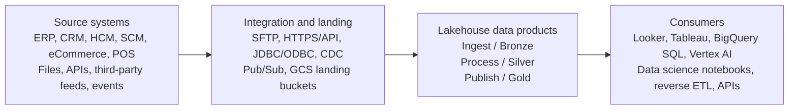
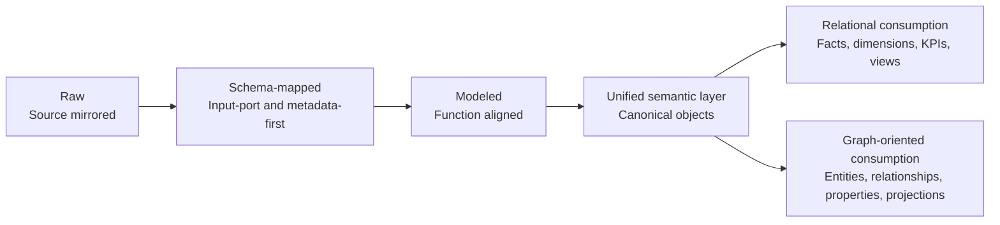
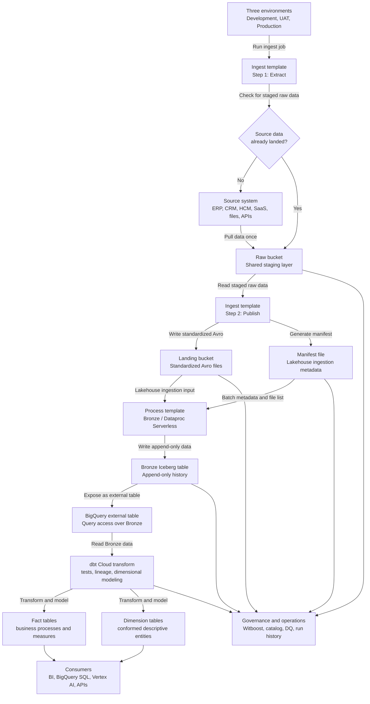

# Data Platform High Level Design

## Table of Contents

1. [Introduction](#1-introduction)
   - [1.1 Requirements Overview](#11-requirements-overview)
   - [1.2 Business Considerations](#12-business-considerations)
   - [1.3 Technical Considerations](#13-technical-considerations)
   - [1.4 Platform Capabilities Targeted](#14-platform-capabilities-targeted)
   - [1.5 Developer Experience](#15-developer-experience)
2. [Scope](#2-scope)
   - [2.1 In Scope](#21-in-scope)
   - [2.2 Out of Scope](#22-out-of-scope)
   - [2.3 Assumptions and Constraints](#23-assumptions-and-constraints)
3. [High-Level Architecture](#3-high-level-architecture)
   - [3.1 System Context](#31-system-context)
   - [3.2 Processing Layer View](#32-processing-layer-view)
   - [3.3 Data Product Ownership Model](#33-data-product-ownership-model)
   - [3.4 Data Flow](#34-data-flow)
   - [3.5 Data Transformations Step by Step](#35-data-transformations-step-by-step)
   - [3.6 Anatomy of a Data Product Pipeline](#36-anatomy-of-a-data-product-pipeline)
   - [3.7 Data Product Repository and Delivery Flow](#37-data-product-repository-and-delivery-flow)
   - [3.8 GCP Service Map](#38-gcp-service-map)
4. [Detailed Component Design](#4-detailed-component-design)
   - [4.1 Ingest Layer](#41-ingest-layer)
   - [4.2 Process Layer](#42-process-layer)
   - [4.3 Publish Layer](#43-publish-layer)
   - [4.4 Orchestration - Cloud Composer](#44-orchestration---cloud-composer)
   - [4.5 Transformation - dbt Cloud](#45-transformation---dbt-cloud)
   - [4.6 Storage - BigQuery, Cloud Storage, BigLake, and Dataplex](#46-storage---bigquery-cloud-storage-biglake-and-dataplex)
   - [4.7 File Format, Layout, and Compression Standards](#47-file-format-layout-and-compression-standards)
   - [4.8 Infrastructure as Code - Terraform, Cloud Build, and Artifactory](#48-infrastructure-as-code---terraform-cloud-build-and-artifactory)
   - [4.9 Governance and Data Product Management - Witboost](#49-governance-and-data-product-management---witboost)
5. [Data Governance and Security](#5-data-governance-and-security)
   - [5.1 Naming Conventions](#51-naming-conventions)
   - [5.2 Access Control](#52-access-control)
   - [5.3 Data Encryption and Sensitive Data Handling](#53-data-encryption-and-sensitive-data-handling)
   - [5.4 Data Quality and Governance Gates](#54-data-quality-and-governance-gates)
   - [5.5 Definition of Done for a Data Product](#55-definition-of-done-for-a-data-product)
   - [5.6 Team and Ownership Model](#56-team-and-ownership-model)
6. [Failure Modes Analysis](#6-failure-modes-analysis)
   - [6.1 Failure Modes, Risks, and Mitigations](#61-failure-modes-risks-and-mitigations)
   - [6.2 Dependencies and Integrations](#62-dependencies-and-integrations)
7. [Other Considerations](#7-other-considerations)
   - [7.1 Testing Strategy](#71-testing-strategy)
   - [7.2 Monitoring, Metrics, and Logging](#72-monitoring-metrics-and-logging)
   - [7.3 Scaling Strategy](#73-scaling-strategy)
   - [7.4 Migration and Environment Promotion](#74-migration-and-environment-promotion)
   - [7.5 Cost Management](#75-cost-management)
   - [7.6 Future Unstructured Data Handling](#76-future-unstructured-data-handling)
8. [Appendix A: Glossary](#appendix-a-glossary)
9. [Appendix B: Data Domains](#appendix-b-data-domains)
10. [Appendix C: Reference Documents](#appendix-c-reference-documents)
11. [Appendix D: Alternative Architectures Considered](#appendix-d-alternative-architectures-considered)

## 1. Introduction

### 1.1 Requirements Overview

Core objective of QXO data platform is to collect data from business source systems - including Mincron and Oracle Fusion/EBS ERPs from the Beacon, TopBuild, and Kodiak acquisitions; Salesforce CRM; HR systems; digital/eCommerce platforms; and third-party feeds - into a single location and to further transform and process them to deliver cleansed, canonicalized, trusted, analytics-ready data for Business Intelligence, enterprise analytics and reporting, AI systems and other downstream consumers.

The data platform is designed to organize diverse data collected from QXO's multiple business units with 100+ source systems into a unified core data foundation using a data mesh approach. In this model, each data asset belongs to a specific business domain and is further packaged as a data product: an atomic, functionally complete unit of data, code, and infrastructure rather than part of a single monolithic database warehouse. Each data product moves through three processing layers: Ingestion, Transformation, and Publish, commonly mapped to the medallion terms Bronze, Silver, and Gold.

The engineering stack for the platform is built using GCPs native services as core components: GCS and Bigquery for Storage, dataproc (Managed Spark) and dbt for compute workloads and Composer + DBT cloud as orchestrator. Based on the current demand, pipelines are primarily batch-oriented so far but for specific usecases will support real-time integration - via Dataflow/Apache Beam - in the future

The design is easiest to follow with working familiarity in several data processing and data management topics: data mesh and data product operating models; lakehouse and medallion architecture; batch ingestion, CDC, and replayable raw data patterns; ELT and SQL transformation with dbt; orchestration with Airflow/Composer; Spark-based distributed processing; BigQuery, GCS, BigLake, and open table formats such as Iceberg; dimensional modeling, semantic layers, and KPI publication; metadata management, lineage, data quality, IAM, and governance controls.

### 1.2 Business Considerations

Lakehouse will support the QXO's rapid enterprise transformation and provide data to track its business growth, operational improvements and productivity. A fully functional lake house is a foundational layer that fulfills several business objectives:

- **Single Source of Truth:** Consolidate data across ERP, SCM, HCM, Pricing, Analytics, and other systems into one trusted repository for all consumers. This ensures consistent, accurate information for everyone.
- **Management and governance:** Ensures that data assets are created, tracked, managed, secured, used and deprecated according to organizational policies and regulatory requirements. This step is vital to maximizing the value of the data by improving its trust, reliability and usability. It also helps in information safety and protection, reducing compliance risks, and safeguarding from operational missteps due to data and tracking errors.
- **Schema Consistency for Self-Service:** Enforce standardized schemas, definitions, and metrics across the organization. A standardized consistent data model is a mandatory first step for agentic or other automation tools to deliver self-service analysis with high reliability.
- **M&A Data Consolidation:** Provide an adaptable framework to ingest and unify data from future acquisitions. Decouple data integration from operational integration to ensure that analytics can move faster than full IT and operational integration during M&A.
- **360° Data Stitching:** Integrate internal and external data sources. For example, combine internal operational data (like leads from CRM, transactions from ERP) with external data (market forecasts, third-party demographics) to enrich insights (e.g. better lead scoring, improved sales forecasting).
- **Historical & Cross-Sectional Analysis:** Retain longitudinal data to analyze time trends. Enable systematic time travel to recreate the state of the past accurately and use it for historical comparisons (year-over-year growth, product evolution). Allow cross-sectional studies by comparing metrics and KPIs across various dimensions as of any single point in time, both present and past.
- **Scalable BI & AI Processing:** Enable broad analytics capabilities - from standard reporting and self-service BI to advanced analytics to AI/ML use cases supporting full Model Development Life Cycle (MDLC) - by providing a scalable platform that can handle growing data and user demands.
- **Data Driven decision making:** Deliver comprehensive progress tracking and actionable intelligence to executive and operational teams, enabling data-driven decision-making that supports business growth and identifies opportunities for cost optimizations.

### 1.3 Technical Considerations

QXO will standup a modern capable lake house with all the industry standard functional and non-functional capabilities (as described above) using GCP native services.

Further, to meet the QXO business goals, there will be a particular focus on implementing the following functionality on top of the platform infrastructure.

- **Functional, Abstract Data Model:** Implement a business-friendly data model (Ontology) that abstracts away source system complexities. Define canonical entities (Customer, Product, Order, etc.) and relationships in the warehouse, independent of how each source system might represent them. This abstraction will be the basis for an API/Schema-led ingestion process that maps all the source data into a unified target model.
- **Robust Entity Management (Master Data):** Use stable, non-recycled identifiers for key business entities in the warehouse. The lake house should assign surrogate keys for internal consistency, decoupling analytics from volatile operational IDs. It must gracefully handle entity merges and splits (e.g. if two customers merge, or a product line splits) while preserving historical records. This implies tracking mappings from source IDs to warehouse IDs and maintaining history of entity hierarchy changes.
- **Data Quality & Governance by Design:** Enforce data quality checks and governance rules at the data model level. This includes using data quality tools (TDQ, BDQ, etc.) and business rules to validate incoming data, plus maintaining metadata lineage and data catalogs. No data ingestion or generation without metadata - every dataset should have owners, definitions, and quality status.
- **Change Data Capture (CDC) & Full History:** Ultimately the lake house is a state machine that transitions its state in schema as well as data based on the inputs it consumes. Adopt proper CDC strategies to capture continuous history of changes in source systems. Every change (in master data or transactions) should be tracked so that the warehouse can reconstruct state at any point in time. The Lakehouse will use an append-only, write-ahead approach: no in-place overwrites of data. For example, implement Slowly Changing Dimensions (Type 2) for key tables to keep prior versions, or use event tables to log every insert/update/delete from sources. Leave no change untracked - ensuring auditability and time-travel queries.
- **Consistency and ACID-like Properties:** Ensure action/state consistency in data processing. If a data load fails halfway, it should not leave partial updates visible. Techniques like write-ahead logs, staging areas, and idempotent pipeline design will guarantee that either an entire batch of changes is applied or none is (failure rollback). Schema changes should also be versioned with history, so that both data and schema evolution are managed.
- **Incremental Processing:** Favor incremental pipelines that append new data (with timestamps or versioning) rather than full reloads. This not only supports CDC and history but also makes processing more efficient and reliable. For instance, use delta update mechanisms where new records and changes are written with new timestamps, rather than wiping out and overwriting large tables.
- **Multiple Ingestion & Consumption Modes:** Support versatile data pipelines - both batch and real-time streaming. Ingestion should handle periodic batch loads (e.g. nightly bulk ETL from ERP), micro-batches or streaming (e.g. capturing events from e-commerce in near-real-time), as well as snapshot vs. incremental updates. Likewise, consumption should support ad-hoc queries, scheduled reports, and real-time dashboards or alerts.

### 1.4 Platform Capabilities Targeted

| Goals | Lakehouse platform target state requirements |
| --- | --- |
| Core Functions | Host a rich set of connector templates to support integration to internal and 3rd party data and external datasets through the data sharing and through streaming and batch interfaces Develop comprehensive set of analytics capabilities for scaling BI and AI. Integration to cutting edge functions in GCP for time-series, geospatial, and predictive analytics Agentic AI - Ecosystem to host and use LLMs, MCP services and build agentic pipelines and applications. Support metadata/knowledge layer to enable this. BI Tooling - Provide a reusable semantic layer for integration to popular visualization tools like Looker, Tableau. Develop rich AI driven platform native reporting ecosystem, Built-In ML Integration - Full support for Model Development Life Cycle (MDLC) and MLOps. |
| Architectural Flexibility | Elastic Scalability - allowing compute and storage to scale automatically and independently, with near-infinite capacity. Decoupled Architecture - separating compute from storage, supporting scaling compute resources without data duplication. Integrated Lakehouse capabilities - converge data lakes and warehouses, support robust, flexible architectures. Unified Storage Layer supporting structured, semi-structured, and unstructured data in one platform. Support for Open Formats - Uses Iceberg for managing large-scale, versioned data. Support for flexible data ingestion - Includes JSON, Avro, Parquet, ORC, and XML. Change Data Capture support - for real-time updates for data freshness and consistency. Pay-as-you-go pricing model scales costs with usage, eliminating hardware provisioning requirements. |
| Performance Scaling | Parallel distributed processing enabling fast querying for large datasets. Tuning to optimize performance automatically based on workload patterns. Low-Latency Ingestion to support querying streaming data in real time. In-database transformations allow ELT-style workflows directly inside the warehouse. Serverless or Managed Infrastructure for automated and better performance management without manual tuning. Query caching through Trinio or Druid, Redis cache services |
| Security | Rollout of secure Lakehouse environments with fine-grained access controls Strong isolation enforced by the cloud platform infrastructure during development and data handling Strong Access Control model for consumption - Granular data asset level RBAC, further refinement through of RLS and CLS based controls for sensitive data handling. Data classification for sensitivity and rolling out policy-based access controls CMEK Encryption at rest and secure access for sensitive data in transit Data Governance features include data lineage, auditing, and compliance support. |
| Reliability | Built-in archival management of ingested data at data product pipeline level Re-creatable medallion layers from raw data for full recoverability Serverless or Managed Infrastructure means reduced risk of human error in patching or tuning. |
| Availability | Cloud-native design already supports continuous availability with automatic failover. Data replication and multi-region support for resilience. |
| Observability | Full lineage tracking all the way to the source through ingestion, transformation steps. Management of the mesh infrastructure and sdlc for data products - Witboost Orchestration of operational monitoring and metrics collection. Centralized log viewing and data pipeline run history Data quality tracking - Freshness, Consistency, Accuracy |

### 1.5 Developer Experience

The lakehouse platform is designed and built to boost developer productivity by turning common data-product engineering tasks into governed, reusable, self-service capabilities. Instead of asking each team to assemble every data product from raw GCP services, custom repositories, manual IAM, hand-written deployment scripts, and one-off governance checks, the platform provides a standard path for product creation, ingestion, transformation, testing, promotion, monitoring, and publication.

This improves productivity by moving repeated platform engineering into templates and automation, while keeping product teams focused on source understanding, business rules, data modeling, quality expectations, and consumer value.

Productivity improvements come from the following platform capabilities:

| Work area | Without platform | With platform | Productivity gain |
| --- | --- | --- | --- |
| New data product setup | Teams manually create repositories, folders, metadata, CI files, service accounts, datasets, buckets, and orchestration skeletons. | Witboost scaffolds the product from approved templates and provisions standard GCP assets through adapters, Terraform, and CI/CD. | Faster start; fewer setup defects; less platform-team ticket dependency. |
| Ingestion buildout | Each team designs its own file layout, manifest handling, raw storage pattern, Spark job, and Airflow DAG. | Standard ingestion templates provide GCS landing, manifest generation, Composer wiring, Dataproc Serverless execution, and Bronze write patterns. | Developers configure source-specific behavior instead of rebuilding ingestion plumbing. |
| dbt and modeling | Teams invent project structure, model layering, naming, tests, documentation, and deployment behavior. | Standard dbt project conventions define source, staging, intermediate, and publish layers with reusable macros, tests, docs, and lineage. | More time on business logic; less time debating structure and release mechanics. |
| Environment promotion | Developers manually coordinate environment variables, deployments, approvals, and production cutover steps. | Development, Staging, and Production promotion follows the scaffolded release workflow with automated validation and approval gates. | Predictable releases; fewer environment drift issues; lower production risk. |
| Security and access | IAM, service accounts, secrets, policy tags, and access requests are handled case by case. | Standard IAM group patterns, Workload Identity, Secret Manager/KMS integration, policy tags, and Witboost access workflows are reused. | Less rework from security review; faster approved access paths. |
| Data quality | Quality checks are added late or inconsistently, often outside the pipeline. | dbt, Great Expectations, inline checks, audit results, and certification evidence are wired into the product lifecycle. | Earlier defect detection; less manual reconciliation before release. |
| Observability and support | Each product invents its own logs, alerts, dashboards, runbooks, and incident routing. | Composer, Dataproc, dbt Cloud, BigQuery, freshness, DQ, lineage, and cost signals follow common monitoring patterns. | Faster triage; lower operational toil; clearer ownership. |
| Discovery and consumption | Consumers rely on tribal knowledge, direct table discovery, or engineer-mediated onboarding. | Witboost marketplace, catalog metadata, output ports, documentation, lineage, and access workflows expose the product consistently. | Less developer time spent answering basic access and usage questions. |

The platform therefore raises productivity in three practical ways:

1. **Reduces build time:** common infrastructure, pipeline skeletons, dbt structure, CI/CD, and governance artifacts are generated or reused.
2. **Reduces review time:** naming, security, metadata, quality, and release controls are embedded into templates instead of rediscovered in each review.
3. **Reduces Management & Support:** monitoring, lineage, audit evidence, access workflow, and operational patterns are consistent across products.

The platform does not remove product-team responsibility. Product teams still own the source semantics, mappings, business logic, model grain, KPIs, quality thresholds, documentation, and consumer commitments. The productivity gain comes from separating product-specific engineering from repeatable platform engineering.

Developer productivity should be measured with concrete indicators: time from product request to scaffolded repository, time to first Development deployment, time to first published output port, release failure rate, number of platform tickets per product, percentage of products using standard templates, mean time to resolve pipeline failures, and amount of manual access or deployment work avoided.

## 2. Scope

### 2.1 In Scope

- Three-layer data architecture: Ingest, Process, and Publish.
- Medallion implementation pattern: Bronze, Silver, and Gold.
- GCP technology stack: Cloud Storage, BigQuery, BigLake, Cloud Composer, Dataproc Serverless, dbt Cloud, Dataplex, Cloud KMS, Pub/Sub, Dataflow, Vertex AI, Cloud Build, Artifactory, and Terraform.
- Data product operating model, including ownership, isolation, provisioning, governance, and certification.
- Development, Staging, and Production environments.
- Orchestration, CI/CD, promotion, testing, quality gates, and release controls.
- Naming standards, access control, service account design, metadata, cataloging, lineage, and security.
- Current gaps and target-state needs for monitoring, disaster recovery, and cost management.

### 2.2 Out of Scope

- Detailed logical and physical models for individual data products.
- Source-system internals beyond their role as ingestion sources.
- Dashboard-level BI design and LookML implementation details.
- Application platforms such as qxo-mobile and qxo-monorepo, except where they consume lakehouse-published data.
- Detailed staffing, project financials, or delivery burn-down plans.

### 2.3 Assumptions and Constraints

- GCP is the cloud provider for the lakehouse.
- BigQuery is the system of record for published structured analytical data.
- Cloud Storage is the durable landing and raw-data persistence layer.
- Development, Staging, and Production are the three platform environments.
- Human access is granted through IAM groups synchronized from the enterprise identity provider, not direct per-user IAM grants.
- Infrastructure provisioning for lakehouse environments is fully automated through code and recreatable on demand
- Data products use bounded repositories, dbt Cloud projects, BigQuery datasets, GCS paths, service accounts, metadata, and quality checks.
- Streaming is supported by the architecture but is not the default pattern unless a source or business use case requires low latency.

## 3. High-Level Architecture

### 3.1 System Context

The lakehouse sits between QXO's source systems and its consumption channels.



Cloud Composer orchestrates movement through the layers. Dataproc Serverless and dbt Cloud perform processing and transformation. BigQuery and BigLake provide query access. Witboost, Dataplex, OpenMetadata, dbt tests, Great Expectations, audit logs, and IAM controls provide governance, quality, lineage, and security.

### 3.2 Processing Layer View

| Layer | Storage boundary | Processing pattern | Main outputs |
| --- | --- | --- | --- |
| Ingest / Bronze | GCS raw buckets, BigQuery `_ingest` datasets, optional BigLake/Iceberg tables | Raw landing, schema validation, source reconciliation, CDC capture, batch registration | Source-fidelity tables and raw files with lineage metadata |
| Process / Silver | BigQuery `_stage` datasets, curated GCS/Parquet where needed | Deduplication, cleansing, conformance, entity resolution, SCD Type 2, business-rule application | Conformed Canonical Model tables and reusable dimensions/facts |
| Publish / Gold | BigQuery `_publish` datasets and governed views | KPI logic, semantic preparation, output ports, business certification | Consumption Data Model, published metrics, reporting tables, AI-ready datasets |

### 3.3 Data Product Ownership Model

A data product is a domain-owned unit of data, code, infrastructure, metadata, and quality rules. It typically includes:

- A Git repository or bounded family of repositories.
- A dbt Cloud project named using `dp_<domain>_<product>`.
- Composer DAGs and configuration files.
- Dataproc Serverless PySpark jobs where required.
- BigQuery datasets for ingest, stage, and publish.
- GCS paths or buckets for landing, raw, curated, exports, and artifacts.
- Service accounts and IAM groups.
- Data Product Descriptor metadata in Witboost.
- Data quality checks, lineage, source-to-target mappings, runbooks, and data dictionaries.

Isolation is enforced through code isolation, compute/orchestration isolation, and data isolation. Cross-product reads require an explicit sharing contract, typically through BigQuery Authorized Views or governed output ports.

### 3.4 Data Flow

The standard data flow is:

1. A source extract, file, CDC feed, API response, or event stream lands in GCS or a streaming ingress service.
2. A Cloud Composer DAG, usually generated from product configuration, triggers validation and processing.
3. A Dataproc Serverless PySpark job reads raw data and writes Bronze data into BigQuery or Iceberg-backed BigLake tables while preserving source fidelity.
4. dbt Cloud applies staging transforms, tests, deduplication, hashing, surrogate-key assignment, entity resolution, and SCD Type 2 logic.
5. Process-layer data lands in `_stage` datasets as conformed Silver data.
6. Publish-layer dbt models produce Gold dimensions, facts, KPIs, and governed views in `_publish` datasets.
7. Quality checks and governance gates determine whether the product can move from Baseline to Governed to Certified.
8. Consumers access the Publish layer through BI tools, BigQuery SQL, Vertex AI, notebooks, APIs, or reverse integration patterns.

### 3.5 Data Transformations Step by Step

Every data product pipeline moves data through a sequence of transformations from source-mirrored raw inputs to governed analytical objects. The stages are intentionally separated so the platform can preserve source replayability, standardize structure, apply business meaning, and expose fit-for-purpose semantic outputs without losing audit history.



Transformation stages:

| Stage | Starting condition | Transformations applied | Primary output |
| --- | --- | --- | --- |
| Raw / source-mirrored | Data arrives as files, API payloads, extracts, logs, transcripts, CDC events, or baseline feeds. It may be unstructured, semi-structured, missing metadata, non-standardized, non-atomic, or multi-valued. | Preserve original payloads, capture source metadata where available, assign batch/run identifiers, store raw files or event payloads, and keep baseline feeds plus CDC streams replayable. | Source-fidelity raw records in GCS and/or Bronze storage with ingestion metadata and lineage anchors. |
| Schema-mapped / input-port and metadata-first | Raw data is available but not yet standardized for lakehouse processing. | Apply source-to-target mappings, standardize lakehouse names and types, validate business and technical rules, convert compound values into first normal form, identify row-level event/entity keys, and identify row-level event timestamps. | Standardized, atomic, schema-aligned rows suitable for deterministic processing and quality checks. |
| Modeled / function-aligned | Data has a stable schema and row-level identity. | Derive latest state from CDC streams, identify business entities, assign lakehouse surrogate keys, establish relationships, merge and stitch attributes across sources, compute base facts/dimensions/metrics, compute aggregate facts/dimensions/metrics, canonicalize outputs where required, and apply incremental changes to historical files or tables. | Conformed Silver and product-specific modeled structures with history, keys, relationships, and reusable business logic. |
| Unified semantic layer / canonical objects | Product-specific physical models are available and governed. | Select analytics-oriented content, organize data by business concepts, expose dimensional relational models, map entities and relationships to ontology concepts for graph-oriented use cases, and publish use-case-aligned views or graph projections. | Governed Gold output ports: dimensional facts, dimensions, KPIs, semantic views, ontology mappings, and graph projections. |

The step-by-step transformation sequence is:

1. **Capture source-mirrored raw data.** The pipeline lands the data as close to the source shape as practical. Inputs can include logs, transcripts, JSON, XML, YAML, CSV, Avro, application extracts, baseline files, and CDC streams. The platform does not assume that raw inputs are complete, normalized, or analytics-ready.
2. **Preserve replayability and lineage.** The raw stage records batch identifiers, source identifiers, source timestamps where available, file manifests, landing paths, and ingestion metadata. This stage is the recovery point for reprocessing and audit.
3. **Map the input port to a lakehouse schema.** The pipeline applies the input-port contract: expected fields, data types, required metadata, naming conventions, and source-to-target mappings.
4. **Run business and technical validations.** Technical checks validate parseability, required fields, schema conformance, record counts, duplicate handling, and timestamp/key availability. Business checks validate domain expectations such as valid statuses, date ranges, referential assumptions, and accepted values.
5. **Normalize to first normal form.** Compound, nested, or multi-valued inputs are converted into rows and columns with atomic values. Arrays, repeated groups, packed strings, and nested structures are split into stable child records where needed.
6. **Identify row-level identity and time.** Each standardized row must have enough metadata to support deterministic processing: event key or entity key, source system key, event timestamp or effective timestamp, load timestamp, and batch/run identifier.
7. **Derive current state from CDC.** Baseline snapshots and CDC streams are reconciled so the platform can represent inserts, updates, deletes, and late-arriving changes. The latest-state view is derived without discarding the underlying change history.
8. **Resolve business entities.** The process layer identifies business entities such as customer, product, order, supplier, location, employee, asset, or transaction. Source-specific identifiers are mapped into lakehouse entity identity.
9. **Assign lakehouse surrogate keys.** Stable `lh_key` values are assigned where governed publish-layer entities require universal, static, non-recycled numeric keys. These keys decouple analytics from operational source identifiers.
10. **Establish relationships.** Entity-to-entity and event-to-entity relationships are built and validated. Referential integrity checks ensure facts can reliably connect to dimensions and canonical entities.
11. **Merge and stitch attributes.** Attributes from multiple sources are reconciled into conformed records. The pipeline applies survivorship, precedence, deduplication, standardization, and conflict-resolution rules.
12. **Compute base analytical structures.** The modeled layer calculates core facts, dimensions, and metrics at their lowest useful grain. These outputs should be reusable across downstream use cases.
13. **Compute aggregate structures.** Where performance, business usability, or semantic clarity requires it, the pipeline creates aggregate facts, summarized dimensions, KPI tables, and derived metrics.
14. **Canonicalize outputs where required.** If multiple products or sources represent the same business concept differently, outputs are aligned to canonical names, entity definitions, relationship definitions, and shared metric logic.
15. **Apply incremental historical changes.** Changes are appended or merged according to the layer's history strategy, including SCD Type 2, event history, CDC application, Iceberg append-only patterns, or BigQuery incremental models.
16. **Publish the semantic layer.** The publish layer exposes only analytics-oriented content. It starts from the domain/product physical model and organizes data by business concepts rather than source-system tables.
17. **Serve relational consumption.** For SQL and BI consumers, the semantic layer uses dimensional models based on star or snowflake schemas. Core entities, relationships, facts, dimensions, and KPIs are exposed as tables, columns, and governed views.
18. **Serve graph-oriented consumption.** For ontology and graph-oriented use cases, entities map to nodes, relationships map to edges, and facts/dimensions/KPIs become properties. Use-case-specific graph projections can be published where needed.
19. **Expose use-case-aligned outputs.** Consumers access relational views, semantic views, authorized views, output ports, or graph projections designed for specific analytics, reporting, AI, or operational use cases.

Quality gates exist between stages. Raw data can be landed even when imperfect, but schema-mapped data must be parseable and metadata-complete enough for processing. Modeled data must satisfy identity, relationship, history, and business-rule checks. Semantic outputs must satisfy ownership, documentation, certification, access-control, and consumer contract requirements before broad publication.

### 3.6 Anatomy of a Data Product Pipeline

A data product pipeline is the executable unit that turns source data into governed analytical assets. It combines environment-specific configuration, ingestion templates, shared raw staging, standardized file publication, manifest-driven lakehouse ingestion, Bronze Iceberg storage, BigQuery access, dbt dimensional modeling, and product-level governance. The pattern is designed so Development, UAT, and Production can run independently while avoiding unnecessary repeated source-system extraction.

The standard pipeline anatomy is as follows:



The flow has two related pipeline modes:

- **Source-ingesting data products:** The product extracts from a source system, stages raw data once, standardizes it into Avro, creates a manifest, and loads it into the lakehouse Bronze layer.
- **Semantic or derived data products:** The product may ingest from existing data products instead of an operational source. In that case, the same dbt and governance pattern produces derived metrics, KPIs, facts, dimensions, or semantic-layer assets.

Pipeline responsibilities by artifact:

| Artifact or component | Role in the pipeline |
| --- | --- |
| `devops/configs/*.yml` | Environment-specific deployment values such as project IDs, domain buckets, service accounts, Workload Identity provider, and Workload Identity pool. |
| Ingest template - Extract | Checks the shared raw staging layer and pulls from the source only when the required raw data is absent. |
| Shared raw bucket | Stores reusable raw staged data so Development, UAT, and Production do not each create unnecessary source-system reads. |
| Ingest template - Publish | Reads staged raw data, writes standardized Avro files to the landing bucket, and generates the manifest required for lakehouse ingestion. |
| Landing bucket | Holds standardized Avro files that serve as the formal lakehouse ingestion input. |
| Manifest file | Captures ingestion metadata such as file list, batch identity, and load context for deterministic Bronze processing. |
| Bronze / Dataproc process template | Consumes landing files and the manifest, then writes append-only Bronze data into Iceberg. |
| Bronze Iceberg table | Provides durable, append-only historical storage with replayability and table-format governance. |
| BigQuery external table | Exposes Bronze Iceberg data to SQL consumers and downstream dbt models without copying the data into a native BigQuery table first. |
| `processing/dbt/` | Applies dbt Cloud transformations, tests, lineage, and dimensional modeling to create facts, dimensions, derived metrics, and KPIs. |
| Witboost Data Product Descriptor | Captures product metadata, input ports, output ports, ownership, quality expectations, lifecycle state, and certification evidence. |

Flow summary:

1. The pipeline runs across Development, UAT, and Production. Without a shared staging pattern, each environment could create a separate read against the source system.
2. Each environment starts ingestion by checking whether the required raw data already exists in the shared raw bucket staging layer.
3. If raw data is absent, the first ingest job pulls the data from the source system and lands it in the raw bucket.
4. If raw data is already present, later ingest jobs reuse the staged raw files instead of reading from the source again.
5. The publish step converts staged raw data into standardized Avro files and generates a manifest for lakehouse ingestion.
6. The Bronze processing step consumes the Avro files and manifest, then writes append-only records into a Bronze Iceberg table.
7. The Bronze Iceberg table is exposed through BigQuery as an external table.
8. dbt Cloud reads the Bronze table and applies dimensional modeling, tests, documentation, and lineage.
9. The modeled outputs become fact tables, dimension tables, derived metrics, KPIs, or semantic-layer assets for governed consumption.

This anatomy separates five concerns that should not be conflated: the **environment** controls where the pipeline runs, the **shared raw staging layer** limits source-system load, the **manifested landing layer** creates deterministic ingestion inputs, the **append-only Bronze table** preserves historical replayability, and the **dbt model layer** turns lakehouse data into governed analytical products.

### 3.7 Data Product Repository and Delivery Flow

Data product repositories are scaffolded by Witboost from approved data product and component templates. Product teams should not create repositories or platform-owned scaffolding manually. They provide product metadata, ownership, input/output contracts, environment parameters, and component selections through Witboost; Witboost uses that metadata to instantiate the repository, descriptor files, CI/CD configuration, and deployable component stubs.

This changes the ownership boundary:

| Responsibility | Owner | Description |
| --- | --- | --- |
| Template and blueprint design | Platform team | Maintains the approved Witboost data product templates, component templates, tech adapters, CI/CD includes, naming standards, and required metadata fields. |
| Product definition | Product owner / PM / steward | Provides the business purpose, domain, owner, steward, inputs, outputs, SLAs, DQ expectations, sensitivity classification, and consumer promises in the Data Product Descriptor. |
| Repository scaffolding | Witboost | Generates the GitLab repository and baseline files from template metadata rather than relying on hand-created repositories. |
| Infrastructure and component provisioning | Witboost + tech adapters + CI/CD | Provisions or updates BigQuery datasets/output ports, GCS storage areas, Dataproc components, Composer/dbt integration points, IAM bindings, and other platform resources through adapter-backed automation. |
| Product implementation | Data engineering team | Implements product-specific ingestion, dbt models, Dataproc/Dataflow logic, tests, documentation, and operational runbooks inside the scaffolded repository boundaries. |
| Release and promotion | Product team + governance + platform automation | Uses GitLab CI/Cloud Build and Witboost release workflows to validate, approve, deploy, and publish the product across environments. |

Witboost-driven creation flow:

1. Product owner and PM define the business use case, KPIs, domain, expected consumers, inputs, outputs, SLAs, and DQ expectations.
2. Product owner creates or updates the Data Product Descriptor in Witboost.
3. Witboost validates required metadata, naming rules, ownership, taxonomy, sensitivity classification, input/output port contracts, and template parameters.
4. Product owner selects the appropriate templates and components, such as BigQuery output port, GCS storage area, Dataproc component, dbt project, or Composer integration.
5. Witboost scaffolds the repository and baseline metadata from the selected templates.
6. Witboost provisioning adapters and CI/CD create or update the required GCP assets, repository settings, environment configuration, and component bindings.
7. Data engineers implement product-specific logic in the scaffolded repository, primarily under dbt models and selected ingestion or processing components.
8. Merge requests run automated validation for code, configuration, contracts, data quality expectations, and infrastructure changes.
9. Witboost release workflow coordinates approval, deployment, promotion, marketplace publication, and certification evidence.

Product teams should modify product-owned artifacts only:

- dbt SQL models, tests, macros, and documentation under the scaffolded dbt project.
- Product-specific ingestion or Dataproc/Dataflow code generated as component stubs.
- Source-to-target mappings, schema contracts, quality expectations, and runbook links where the template exposes those as product-owned configuration.
- Product documentation, ownership notes, support channel, operational runbook, and consumption examples.

Product teams should avoid changing template-owned scaffolding unless the platform team approves an exception:

- Shared CI authentication includes and Workload Identity wiring.
- Generated service account, bucket, dataset, and project identifiers.
- Required metadata keys generated from the DPD and component templates.
- Tech adapter configuration and platform-managed deployment scripts.

CI/CD behavior from the scaffolded templates:

- `.gitlab-ci.yml` includes shared platform authentication and deployment templates.
- Feature branches raise merge requests into the main integration branch.
- Automated jobs validate template metadata, GCP authentication, contracts, dbt configuration, and selected component configuration.
- Environment promotion is controlled by the scaffolded release workflow and Witboost governance gates.
- UAT and Production promotion require successful validation, required approvals, and compatible product contracts.

Environment-specific values should be generated from template metadata or maintained only in approved configuration files. Build artifacts such as `target`, `dbt_packages`, and `dbt_internal_packages` should stay out of Git. If a generated repository is missing required environment values or component bindings, the preferred fix is to correct the Witboost template metadata or rerun provisioning rather than manually patching platform-owned files.

### 3.8 GCP Service Map

| Service | Role in the lakehouse |
| --- | --- |
| Cloud Storage | Raw landing, file persistence, unstructured data, curated Parquet, Composer artifacts, and exports. |
| BigQuery | Central analytical warehouse, structured storage, SQL transformation target, data marts, BI serving, and audit/reconciliation queries. |
| BigLake | Unified access layer for open-format data in Cloud Storage, especially Iceberg-backed tables. |
| Dataproc Serverless | Managed Spark execution for ingestion, parsing, heavy transforms, and Bronze writes. |
| Cloud Composer | Managed Airflow orchestration for schedules, dependencies, retries, alerts, and DAG execution. |
| dbt Cloud | SQL modeling, transformation, tests, documentation, dependency management, scheduling/job execution where appropriate, and promotion of stage/publish models. |
| Pub/Sub | Event ingress and decoupled messaging for future low-latency sources. |
| Dataflow | Apache Beam stream/batch processing for near-real-time pipelines where Spark/Composer is not the best fit. |
| Vertex AI | Model training, deployment, notebooks, feature workflows, and AI/ML lifecycle support. |
| Dataplex | Data discovery, governance, zones, and policy integration across lake and warehouse assets. |
| OpenMetadata | Metadata, glossary, lineage, ownership, and catalog integration where deployed. |
| Witboost | Data product descriptors, provisioning adapters, ownership workflows, and certification gates. |
| Cloud KMS | Customer-managed encryption keys for sensitive data and envelope encryption patterns. |
| Terraform | Infrastructure, IAM, service accounts, project resources, and repeatable environment provisioning. |

## 4. Detailed Component Design

### 4.1 Ingest Layer

The Ingest layer lands source data with minimal transformation while preserving source fidelity, replayability, lineage, and raw history. It supports structured, semi-structured, and unstructured sources.

Primary responsibilities:

- Receive files through SFTP, HTTPS, API pull, source push, JDBC/ODBC extraction, CDC, or event-triggered ingestion.
- Persist raw inputs in Cloud Storage before downstream transformation.
- Register batch identifiers, file manifests, watermarks, and source metadata.
- Validate basic schema, required fields, record counts, freshness, and file integrity.
- Write Bronze tables into BigQuery `_ingest` datasets or Iceberg-backed BigLake tables where appropriate.
- Quarantine bad records or malformed files without publishing partial or corrupted data.

Recommended ingestion modes:

| Mode | Description | Typical implementation |
| --- | --- | --- |
| Batch bulk load | Scheduled extraction of high-volume structured data. | Composer DAG -> GCS -> Dataproc Serverless -> BigQuery. |
| API-led mini-batch | Periodic REST/HTTPS pulls from SaaS, vendors, or microservices. | Composer Python operator or Cloud Run job -> GCS/BigQuery. |
| CDC | Incremental database change capture. | CDC connector or source export -> GCS/BigQuery with append-only history. |
| Event-triggered file processing | Pipeline starts when a file lands. | GCS event or Composer sensor -> Dataproc/dbt Cloud. |
| Near-real-time stream | Low-latency event processing where business need exists. | Pub/Sub -> Dataflow or Spark streaming -> BigQuery. |

### 4.2 Process Layer

The Process layer builds the Conformed Canonical Model. This is the point where source-specific pipelines merge into standardized entities and reusable business structures.

Primary responsibilities:

- Standardize schemas, names, datatypes, and source metadata.
- Deduplicate records and enforce grain.
- Resolve entities across sources.
- Generate and maintain surrogate keys such as `lh_key`.
- Track source-to-warehouse key mappings.
- Apply SCD Type 2 logic for history-bearing dimensions.
- Apply shared business rules such as fiscal calendar alignment, currency conversion, hierarchy handling, rebate rules, and status standardization.
- Maintain auditability through checksums, effective dates, and load metadata.

### 4.3 Publish Layer

The Publish layer exposes business-facing data products through governed output ports. Consumers should read from Publish rather than directly from Ingest or Process.

Lakehouse reporting is analytical reporting, not a replacement for operational application reporting. The lakehouse is the system for trusted, cross-domain metrics, KPIs, dimensions, historical trends, self-service BI, AI/ML consumption, and executive or management reporting. Operational reporting remains closest to the source applications when the report is part of day-to-day transaction execution, workflow monitoring, exception handling, or immediate operational control.

The QXO architecture positions the Gold layer as the reporting and consumption layer: it consists of metrics, KPIs, dimensions, and other readily consumable information for analytics and AI work. These outputs may be generated on demand for self-service or analytical exploration, and cached or materialized when creation is resource-intensive, time-sensitive, or repeatedly consumed. Ownership of metrics can be namespaced and delegated to business experts in sub-domains while still using common platform standards for governance, access, lineage, and quality.

| Reporting type | Primary purpose | Typical source | Lakehouse role |
| --- | --- | --- | --- |
| Operational reporting | Support immediate business operations, transaction follow-up, workflow exceptions, and source-system process control. | ERP, CRM, HCM, eCommerce, TMS, WMS, POS, and other operational applications. | Ingests and preserves the data for downstream analytics, but does not replace application-native operational reports where low-latency workflow control is required. |
| Lakehouse reporting | Provide governed metrics, KPIs, trends, cross-domain analysis, standardized definitions, historical comparison, and BI/AI-ready datasets. | Publish/Gold data products built from conformed lakehouse data. | Serves as the trusted analytical reporting layer through BigQuery, Looker, Tableau, semantic views, authorized views, notebooks, Vertex AI, and other approved consumption patterns. |

Primary responsibilities:

- Publish facts, dimensions, metrics, KPIs, and curated analytical tables.
- Provide stable schemas for BI, analytics, AI/ML, and downstream applications.
- Enforce business sign-off, reconciliation, semantic consistency, and certification gates.
- Carry required identifiers and metadata, including `lh_key`, natural keys, source identifiers, load timestamps, and effective date columns where applicable.
- Provide authorized views or governed shares for cross-product consumption.

### 4.4 Orchestration - Cloud Composer

Cloud Composer is the orchestration backbone for ingestion, transformation, validation, and publication. DAGs schedule or trigger pipeline tasks, manage dependencies, coordinate retries, and emit operational alerts.

The standard configurable DAG pattern uses:

- `pipeline_config.yaml`: DAG id, schedule, domain, source tables, load type, dependencies, and task sequence.
- `job_config.yaml`: Spark job definition, runtime parameters, target table, file format, and BigQuery/Iceberg output.
- `schema_config.yaml`: column mapping, target types, schema rules, and validation expectations.

DAGs and job artifacts are deployed through Cloud Build and managed through Artifactory-backed artifact flows where applicable. Direct manual edits in running Composer environments should not be treated as an approved operational pattern.

### 4.5 Transformation - dbt Cloud

dbt Cloud is the platform transformation and testing framework for stage and publish modeling. It supports modular SQL models, reusable macros, tests, documentation, lineage, environments, jobs, and Cloud Build integration for governed delivery flows.

Transformation standards:

- Use source models for raw inputs.
- Use staging models for type casting, renaming, and normalization.
- Use intermediate models for reusable business logic.
- Use marts or publish models for consumer-facing facts, dimensions, and metrics.
- Use dbt tests for uniqueness, not-null, relationships, accepted values, freshness, and custom business rules.
- Maintain source-to-target mappings and model documentation with every data product.

### 4.6 Storage - BigQuery, Cloud Storage, BigLake, and Dataplex

BigQuery is the primary structured storage and query engine across Ingest, Process, and Publish. Dataset suffixes define layer boundaries:

- `_ingest` for Bronze/source-fidelity data.
- `_stage` for Silver/conformed processing data.
- `_publish` for Gold/consumption data.

Cloud Storage holds raw landed extracts, unstructured assets, archived raw history, curated Parquet files, Composer artifacts, and exports. BigLake exposes open-format data in Cloud Storage to BigQuery. Iceberg is the primary documented open table format in the current HLD source.

Dataplex and OpenMetadata support discovery, metadata management, lineage, glossary, zone organization, and governance integration.

### 4.7 File Format, Layout, and Compression Standards

Recommended file formats:

| Data type | Recommended format | Notes |
| --- | --- | --- |
| Structured batch exchange | Avro | Self-describing schema, efficient BigQuery load, compressible, suitable for source exports. |
| Curated file storage | Parquet | Columnar, compressed, efficient for Spark and external analytical queries. |
| Semi-structured data | JSON | Appropriate for nested API payloads and flexible source structures. |
| Simple tabular exchange | CSV | Accepted for legacy/API interchange; schema must be externally controlled. |
| Unstructured data | Native binary files in GCS | PDFs, images, documents, and logs stored separately with metadata in BigQuery/catalog. |

Recommended GCS layout:

```text
gs://<bucket>/<zone>/<source_or_domain>/<dataset>/<yyyy>/<mm>/<dd>/<file>
gs://qxo-lakehouse-raw/crm/customers/2025/08/06/customers_2025-08-06.json
gs://qxo-lakehouse-raw/erp/orders/2025/08/06/orders_2025-08-06.avro
gs://qxo-lakehouse-curated/sales/transactions/year=2025/month=08/day=06/part-00001.parquet
```

Compression standards:

- Compress text formats such as CSV, JSON, and TSV with GZIP unless a source-specific constraint prevents it.
- Use Snappy or Deflate for Avro.
- Use Snappy for Parquet by default.
- Avoid archive formats that hide many files inside a single ZIP in the processing path; extract archives into individual processable files.
- Prefer fewer well-sized files over excessive small files to reduce Spark and BigQuery overhead.

### 4.8 Infrastructure as Code - Terraform, Cloud Build, and Artifactory

Terraform is the system of record for GCP infrastructure and IAM. Cloud Build is the authoritative build and deployment service for lakehouse platform workflows, and Artifactory is used for managed build artifacts/packages used by Witboost-enabled provisioning and deployment flows. The documented lakehouse repositories include infrastructure, Composer, Spark, dbt Cloud project code, and shared Terraform module codebases.

Representative repository responsibilities:

| Repository | Purpose | Provisions or contains |
| --- | --- | --- |
| `lakehouse-infrastructure` | Core lakehouse infrastructure | GCS, BigQuery datasets, BigLake connections, Composer environments, Dataplex, firewall rules. |
| `qxo-nexus-infrastructure` | Next-generation Nexus infrastructure | Service accounts, API enablement, Workload Identity Federation, KMS, Secret Manager, SFTP, Witboost bindings. |
| `qxo-lh-terraform-modules` | Shared module library | Reusable Terraform modules. |
| `qxo-lakehouse-composer` | Composer application code | DAGs, plugins, environment configuration. |
| `qxo-lakehouse-spark` | Spark application code | PySpark extraction and Bronze processing jobs. |
| dbt project repositories | dbt project code | dbt models, macros, tests, exposures, and documentation. |

Cloud Build pipelines validate, build, and deploy Terraform, Composer, dbt, Spark, and related platform artifacts. Artifactory stores versioned deployable artifacts and packages consumed by Witboost and platform automation.

### 4.9 Governance and Data Product Management - Witboost

Witboost is the data product control plane for the lakehouse. It does not replace GCS, BigQuery, Dataproc, Dataflow, Composer, dbt Cloud, Dataplex, OpenMetadata, IAM, Terraform, GitLab, Artifactory, or Cloud Build. Instead, it sits above those execution and infrastructure services and provides the governed operating layer for how data products are created, provisioned, changed, certified, discovered, accessed, monitored, and retired.

In this architecture, the data platform has three practical planes:

| Plane | QXO implementation | Primary concern |
| --- | --- | --- |
| Infrastructure and execution plane | Terraform, Cloud Build, Artifactory, Composer, Dataproc Serverless, dbt Cloud, GCS, BigQuery, BigLake/Iceberg, IAM, KMS. | Deploy, process, store, secure, and operate data workloads. |
| Witboost control plane | Data Product Descriptor, blueprint/templates, component templates, tech adapters, provisioning workflow, computational governance, policy checks, release workflow, approval gates. | Standardize how data products are defined, validated, provisioned, promoted, governed, changed, and retired. |
| Witboost market plane | Marketplace, product catalog, consumables, data contracts, ownership, quality indicators, lineage links, access requests, usage and review workflows. | Help consumers discover trusted products, understand their fitness for use, and request access through an auditable path. |

The Data Product Descriptor (DPD) is the primary control-plane contract. It formalizes the product definition and captures domain, subdomain, purpose, product owner, technical owner, steward, input ports, output ports, schema contracts, SLAs, freshness/latency promises, data quality expectations, and downstream consumer promises. The physical implementation may live in GitLab repositories, GCS paths, BigQuery datasets, dbt projects, Composer DAGs, Dataproc jobs, service accounts, and IAM groups, but Witboost provides the control surface that binds those assets into a governed data product.

Witboost is the governance-aware orchestration layer for the full data product lifecycle management:

| Lifecycle workflow | Role of Witboost | Delegated execution systems |
| --- | --- | --- |
| Product creation | Starts from approved blueprints/templates, creates the DPD, captures ownership, contracts, SLAs, taxonomy, documentation completeness, and initial component definitions. | GitLab repositories, Terraform/Cloud Build, GCS, BigQuery, dbt Cloud, Composer, Dataproc/Dataflow. |
| Governance and approval | Applies classification, policy validation, naming/taxonomy checks, metadata completeness checks, data owner approval, steward review, and automated quality/schema gates. | IAM, DLP/scanning tools, dbt tests, Great Expectations or equivalent DQ tooling, Dataplex/OpenMetadata. |
| Deployment and promotion | Coordinates release workflow across Development, UAT, and Production, including CI/CD, contract compatibility checks, stakeholder notifications, and publication to the marketplace. | GitLab CI, Cloud Build, Artifactory, Composer, Dataproc, dbt Cloud, BigQuery. |
| Change management | Classifies breaking vs. non-breaking changes, triggers impact review, notifies downstream consumers, versions the product contract, and records migration notes. | Repository pull requests, dbt docs, lineage tooling, catalog updates, deployment pipelines. |
| Access request | Lets consumers request access from the marketplace, captures purpose and scope, routes approvals to owners/stewards, and records the audit trail. | IAM groups, BigQuery authorized views/shares, Looker permissions, identity provider workflows. |
| Monitoring and incident workflow | Routes DQ, SLA, or pipeline incidents to the right product owners, links runbooks, tracks status, and communicates impact to subscribers. | Composer alerts, Dataproc logs, dbt Cloud job status, BigQuery audit logs, DQ audit tables, incident/ticketing tools. |
| Deprecation and retirement | Notifies consumers, reviews usage and dependencies, records stakeholder approval, and coordinates archive, unpublish, revocation, or teardown. | Catalog, IAM, Terraform/Cloud Build, storage lifecycle policies, repository/archive workflows. |

The perimeter of control is important. Witboost governs and coordinates the lifecycle, but execution remains in the underlying platform:

| Witboost governs or orchestrates | Witboost does not directly perform |
| --- | --- |
| Product metadata, ownership, contracts, policies, approvals, releases, access-request workflow, certification state, marketplace publication, change governance, and retirement workflow. | Data storage, query execution, Spark/dbt transformations, Airflow scheduling, row/column security enforcement, masking, data quality computation, technical lineage extraction, anomaly detection, identity management, or semantic-model authoring. |

The main user journeys are:

| User group | How they engage with Witboost | Outcome |
| --- | --- | --- |
| Platform team | Defines data landscapes, domains, templates, data product descriptor standards, input/output port contracts, component templates, tech adapter configuration, CI/CD integrations, and provisioning workflows. | Product teams receive standardized self-service paths, while platform controls remain consistent across domains. |
| Product manager / data product owner | Starts with business use case and KPI definition, creates or updates the DPD in Witboost, captures input/output contracts, SLAs, DQ expectations, and coordinates sign-off with modeling, engineering, and business stakeholders. | The data product has an accountable owner, measurable purpose, documented scope, and an explicit product contract before implementation proceeds. |
| Data engineering team | Reviews the Confluence product documentation and DPD, validates access to provisioned repositories/GCP assets, implements ingestion and transformations using standard patterns, publishes DQ metrics, configures Composer, and deploys through CI/CD. | Implementation stays aligned to the product contract and platform standards while allowing product-specific logic in dbt, Dataproc, or Dataflow. |
| Data steward / SME | Reviews business definitions, sensitivity classification, quality expectations, KPI correctness, lineage, reconciliation evidence, and certification readiness. | Published products carry business trust signals, not only technical schemas. |
| Governance team | Defines policy checks, metadata requirements, approval flows, classification requirements, certification gates, and access review/recertification processes. | Governance is embedded into creation, release, access, and change workflows rather than handled as an after-the-fact review. |
| Data consumer | Searches the marketplace, reviews product description, owner, schema, lineage, DQ status, contracts, SLA, output ports, and available consumables, then requests access with purpose and scope. | Consumers can identify fit-for-use data products and obtain approved access through a traceable workflow. |

QXO-specific implementation considerations from DAAS guidance:

- Witboost uses component and tech adapter patterns for GCP resources such as BigQuery output ports, GCS storage areas, Dataproc components, and Composer/dbt integration.
- BigQuery output-port templates can carry expectation suites for dimensional-column quality checks; runtime DQ checks should publish results back into platform observability and governance flows.
- Dataproc components can reference shared and custom Python libraries through the configured Artifact Registry; required custom libraries must be published before provisioning.
- Data product and component creation depends on GitLab integration and user permissions. Users creating or releasing data products need valid GitLab token configuration and appropriate Witboost RBAC, including data-product developer permissions where applicable.
- Domains are registered as Git-backed catalog metadata and imported into Witboost; creating a domain in Git alone is not sufficient unless the entity is imported.
- Tech adapters are independent from the main Witboost deployment and can be versioned and updated separately.
- Composer/Airflow requires explicit connections for dbt Cloud and Witboost integration. Connection IDs must be unique, service tokens must be stored securely, and credentials must not be embedded in DAG code or documentation.

For QXO, Witboost should be treated as the system of engagement and control for data products, while GCP remains the system of execution and BigQuery/GCS remain the systems of analytical storage. A user should go to Witboost to create, describe, release, certify, discover, and request access to a data product. The same user should go to GitLab, dbt Cloud, Composer, Dataproc, BigQuery, or GCS for implementation, operations, or consumption details that are governed by the product's DPD and marketplace contract.

Certification tiers:

- **Baseline:** Minimum metadata, ownership, schema, and operational controls exist.
- **Governed:** Data quality, lineage, access control, and publish-readiness controls are in place.
- **Certified:** Executive or finance-grade data with reconciliation, business sign-off, lineage, ownership, and operational runbooks.

## 5. Data Governance and Security

### 5.1 Naming Conventions

| Resource | Convention | Example |
| --- | --- | --- |
| BigQuery dataset | `<domain>_<product>_[ingest|stage|publish]` | `sales_moneymap_publish` |
| dbt Cloud project | `dp_<domain>_<product>` | `dp_sales_moneymap` |
| Publish dimension | `<entity>_dim_publish` | `customer_account_dim_publish` |
| Publish fact | `<process>_fct_publish` | `sales_order_fct_publish` |
| Process conformed table | `<domain>_<entity>_con` | `custmr_cust_con` |
| IAM group | `gcp-<environment>-<domain>-<role>` | `gcp-production-sales-data-viewer` |
| Surrogate key | `lh_key` | `lh_key` |

Column naming standards:

- Use lowercase `snake_case`.
- Avoid spaces and special characters.
- Prefer descriptive names over generic `id` or `name`.
- Prefix boolean columns with `is_`, `has_`, or `does_`.
- Use meaningful suffixes such as `_id`, `_key`, `_cd`, `_amt`, `_dt`, `_ts`, `_pct`, and `_qty`.
- Document timezone assumptions for date/time fields.

### 5.2 Access Control

Access is based on least privilege, environment separation, and group-based authorization.

Human role categories:

- Cloud Developer / Software Engineer.
- ETL Developer / Data Engineer.
- Report Creator / BI Developer.
- ML Engineer / Data Scientist.
- Report Viewer / Data Viewer.
- Data Owner / Domain SME.
- Lakehouse administrator.
- Governance steward.

Administration responsibilities:

- Infrastructure and service provisioning.
- Resource access management.
- Storage, archival, and retrieval.
- Platform monitoring.
- Billing and cost usage tracking.
- Scheduling and execution.
- Log monitoring and alerts.
- Failure triage.
- Resource utilization review.

Governance responsibilities:

- Data catalog and metadata management.
- Data security and access protection.
- Data accuracy, completeness, and quality control.
- SDLC governance for software and ETL.
- Test coverage, code review, and security audit checks.
- ML/model governance, model cataloging, versioning, validation, access, retraining, and retirement controls.

Service accounts require the same design rigor as human access. Each workflow should have a purpose-specific service account with only the required GCS, BigQuery, Composer, Dataproc, KMS, Secret Manager, and logging permissions.

### 5.3 Data Encryption and Sensitive Data Handling

Security controls apply in transit, at rest, and at query time.

- **Encryption at rest:** Cloud Storage and BigQuery use encryption at rest by default. Sensitive datasets should use CMEK through Cloud KMS where stronger key control is required.
- **Encryption in transit:** API pulls use HTTPS/TLS. File transfers use SFTP or HTTPS. Public or cross-network endpoints must enforce encrypted transport.
- **Column protection:** Sensitive columns use policy tags, column-level access control, masking, hashing, or encryption as appropriate.
- **PII handling:** PII may be encrypted or tokenized before landing in the ingest layer for high-risk domains. The HR employee-master pattern uses Tink AEAD and Cloud KMS envelope encryption.
- **Data Loss Prevention:** DLP scanning may be integrated for sensitive data detection and classification.
- **Auditing:** GCS access logs, BigQuery audit logs, Composer logs, and lineage metadata provide traceability.

### 5.4 Data Quality and Governance Gates

Quality checks are embedded in pipeline transitions.

| Layer | Checks | Owner |
| --- | --- | --- |
| Ingest | Schema conformance, non-null checks, uniqueness checks, freshness, source reconciliation, file integrity. | Data Engineering / Platform |
| Process | Grain checks, key checks, referential integrity, SCD validity, entity resolution checks, business rule validation. | Data Engineering / Modeling |
| Publish | KPI reconciliation, semantic consistency, metric tie-out, dashboard validation, business sign-off. | Data Product Owner / Analytics / Business |

Tooling:

- dbt tests for structural and relationship tests.
- Great Expectations or custom Python checks for profiling and statistical validation.
- Composer for orchestration, retries, and failure routing.
- BigQuery for reconciliation and audit queries.
- Witboost for certification gates.
- OpenMetadata and Dataplex for lineage, catalog, and glossary.

The enterprise `dq_audit_fact` pattern is a target design for append-only quality scoring and audit history. It should be treated as not yet confirmed implemented unless validated separately.

### 5.5 Definition of Done for a Data Product

A production-ready data product should include:

- Wiki or product documentation page.
- Use cases and consumer list.
- Architecture diagram.
- Input and output ports.
- Table list and catalog registration.
- Per-table data dictionary.
- PII and sensitivity classification.
- Source-to-target mapping.
- Refresh schedule and SLA.
- Naming convention review.
- Access-control review.
- Automated quality checks.
- Alerting and operational runbook.
- SQL user guide or consumption examples.
- Owner, steward, and support contacts.
- Independent review and sign-off.
- Versioning, deprecation, and consumer-onboarding process.

### 5.6 Team and Ownership Model

| Team or role | Responsibilities |
| --- | --- |
| Nexus | Shared lakehouse platform, Terraform, CI/CD templates, core IAM, infrastructure, and cross-cutting governance. |
| Weave | Product architecture and data product design support. |
| Lumina | Looker/BI development and dashboarding aligned to data products. |
| Domain teams | Business logic, modeling, quality rules, ownership, prioritization, and sign-off for domain data products. |
| Data Engineering | Pipelines, ingestion, transformation, testing, and operational support. |
| Data Owners / SMEs | Business definitions, semantic correctness, certification, and stewardship. |

## 6. Failure Modes Analysis

### 6.1 Failure Modes, Risks, and Mitigations

| Failure mode | Mitigation |
| --- | --- |
| Source extract fails or arrives malformed | Composer retries, schema checks, freshness checks, source reconciliation, quarantine area, and no publish promotion. |
| API extraction returns partial data | Batch IDs, checkpoints, source count reconciliation, idempotent loads, and replay from last successful watermark. |
| Duplicate ingestion occurs | Unique batch IDs, manifest tracking, checksums, idempotent merge logic, and natural-key tests. |
| Conformance produces duplicate or orphan canonical records | dbt grain, uniqueness, relationship, and referential-integrity tests block promotion. |
| Published metrics do not reconcile | KPI tie-out and business sign-off block Certified status. |
| One data product fails | Product-level repo, DAG, dataset, and service-account isolation limits blast radius. |
| BigQuery table is dropped or overwritten | BigQuery time travel recovery within the available recovery window; recreate views from source control or audit logs. |
| Composer environment outage | Current confirmed design has per-environment Composer dependency; target-state DR should define warm standby or restore process. |
| Unauthorized sensitive data access | IAM groups, policy tags, authorized views, audit logs, CMEK, and encryption/masking for sensitive domains. |
| Bad infrastructure change reaches Production | Terraform merge request review, protected branches, named approvers, environment promotion, and rollback plan. |
| Excessive query cost | Partitioning, clustering, query review, cost monitoring, slot/reservation evaluation, and lifecycle policies. |

### 6.2 Dependencies and Integrations

| Component | Purpose | Failure handling |
| --- | --- | --- |
| Cloud Composer | Pipeline orchestration | DAG retries, task logs, failure alerts, and run history. |
| Dataproc Serverless | Spark ingestion and heavy processing | Composer-level retry, job logs, idempotent writes, and rerun from raw data. |
| BigQuery | Warehouse and serving layer | Time travel, table snapshots where adopted, audit logs, and source-controlled DDL. |
| Cloud Storage | Raw and file storage | Versioning/lifecycle policies where configured, replay from raw files, and bucket-level IAM. |
| dbt Cloud | SQL transformations and tests | Cloud Build validation, dbt test failures, documentation, and model lineage. |
| Witboost | Governance and provisioning workflow | Existing runtime pipelines continue, but new provisioning/certification may be blocked during outage. |
| Cloud Build and Artifactory | Build, artifact management, and deployment | Cloud Build validations, versioned artifacts, approval gates, scans, and environment promotion controls. |
| Dataplex/OpenMetadata | Catalog, lineage, governance metadata | Operational pipelines can run, but discoverability and governance visibility may be degraded. |

## 7. Other Considerations

### 7.1 Testing Strategy

Testing is layered across design-time, deployment-time, and runtime controls. The platform should distinguish between **inline tests**, which execute inside the pipeline and can block a run or promotion, and **offline tests**, which run outside the critical pipeline path for deeper profiling, reconciliation, trend analysis, and certification evidence.

| Test category | Execution point | Typical tools | Purpose | Promotion behavior |
| --- | --- | --- | --- | --- |
| Static and build tests | CI/CD before deployment | GitLab CI, Cloud Build, linters, unit tests, security scans, dependency scans. | Validate repository structure, template conformance, code quality, dependencies, and build readiness. | Blocks merge or deployment when required checks fail. |
| Contract and metadata tests | Witboost release workflow and CI/CD | Witboost DPD validation, template checks, policy checks, schema compatibility checks. | Validate ownership, input/output contracts, required metadata, naming standards, schema compatibility, DQ expectations, and lifecycle state. | Blocks release or promotion when mandatory product contract requirements are missing or incompatible. |
| Inline pipeline tests | Composer/Airflow pipeline tasks | dbt tests, Great Expectations checkpoints, custom SQL, Python validators, BigQuery reconciliation SQL. | Validate data while the pipeline runs: file presence, parseability, row counts, required fields, freshness, nulls, uniqueness, referential integrity, accepted values, and critical business rules. | Critical failures stop the DAG, quarantine data, or prevent publish-layer promotion. |
| Offline analytical tests | Scheduled or ad hoc jobs outside the critical path | Great Expectations, OpenMetadata profiler/test cases, custom SQL, BigQuery notebooks/queries, BI reconciliation workbooks. | Detect drift, distribution changes, trend anomalies, historical quality degradation, benchmark mismatches, and cross-product inconsistencies. | Does not usually block the current run, but feeds incidents, scorecards, certification, and product improvement backlog. |
| Business validation tests | UAT and certification workflow | Reconciliation reports, SME review, dashboard comparison, KPI tie-outs, finance/operations sign-off. | Confirm semantic correctness, metric definitions, aggregation behavior, and report parity against trusted legacy outputs or agreed business benchmarks. | Required for Governed or Certified product status where business-critical metrics are exposed. |

Inline testing should be placed at the point where failure is cheapest and safest:

1. **Ingest inline tests:** Validate landing manifests, file format, schema parseability, required columns, row counts, duplicate files, freshness, source control totals, and basic metadata before writing or exposing Bronze data.
2. **Process inline tests:** Validate primary keys, `lh_key` assignment, uniqueness, referential integrity, SCD Type 2 date ranges, CDC application, entity resolution, and conformance rules before data is promoted to reusable Silver models.
3. **Publish inline tests:** Validate metric logic, accepted values, dimensional joins, KPI reconciliation, row-level security assumptions, column sensitivity flags, and output-port contracts before consumers can rely on Gold assets.

Offline testing complements inline gates:

- Profile large tables and columns without extending the critical DAG runtime.
- Compare multi-day or multi-period trends, distributions, and volume changes.
- Reconcile published facts against source reports, ERP totals, or finance-approved benchmarks.
- Run deeper statistical, anomaly, and drift checks that are too expensive for every pipeline run.
- Produce quality history for certification, audit, stewardship, and executive scorecards.

Data Guardian / GX Guardian is the Witboost-managed runtime quality component for the pro-code data quality pattern. Its role is not to replace dbt, Great Expectations, Airflow, BigQuery, or OpenMetadata. Instead, Witboost templates and descriptors define the required quality standard, then Data Guardian/GX Guardian helps provision and execute the generated validation assets and report normalized evidence back into the governance ecosystem.

In the target pattern:

1. Teams define product quality requirements in the Witboost Data Product Descriptor and output-port metadata.
2. Witboost templates generate or configure dbt tests, Great Expectations suites, Airflow task wiring, and emitter settings.
3. Composer/Airflow executes the inline checks at the correct pipeline stage.
4. dbt, Great Expectations, custom SQL, or OpenMetadata tests produce validation results.
5. Data Guardian/GX Guardian normalizes and publishes quality evidence where applicable.
6. Results are written to the enterprise `dq_audit_fact` ledger in BigQuery and exposed through OpenMetadata or product scorecards.
7. Witboost uses the resulting evidence for release gates, certification, access confidence, and lifecycle governance.

The governing principle is: **Witboost defines and enforces the standard; Data Guardian/GX Guardian operationalizes the standard; dbt, Great Expectations, SQL, and profiling tools execute the checks; BigQuery and OpenMetadata preserve and expose the evidence.**

### 7.2 Monitoring, Metrics, and Logging

Current operational capabilities include Composer/Airflow task logs, DAG run history, job failure notifications, Dataproc logs, BigQuery audit logs, and GCS logs. Target-state monitoring should include:

- Unified pipeline health across Composer, Dataproc, dbt Cloud, BigQuery, and GCS.
- Freshness, latency, completeness, and quality metrics by data product.
- SLA/SLO dashboards.
- Alert routing to JSM, PagerDuty, Slack, or email based on severity.
- Data quality audit history in BigQuery.
- Cost and utilization dashboards by product, environment, and team.

### 7.3 Scaling Strategy

Technical scaling is provided by managed GCP services:

- BigQuery scales analytical query execution.
- Dataproc Serverless scales Spark jobs without long-lived cluster management.
- Cloud Storage scales raw and unstructured storage.
- Pub/Sub and Dataflow support event-driven and streaming use cases.
- BigLake allows open-format data in GCS to participate in BigQuery analytics.

Organizational scaling comes from data product isolation. New domains and products are onboarded as bounded units rather than by adding all work to a shared monolithic warehouse codebase.

### 7.4 Migration and Environment Promotion

The platform uses Development, Staging, and Production environments.

Recommended data product promotion path:

1. Create or update the data product and component metadata in Witboost.
2. Let Witboost scaffold or update the repository, descriptor files, CI/CD includes, and component configuration from approved templates.
3. Implement product-specific logic in the scaffolded repository.
4. Raise a merge request and run automated validation for code, contracts, metadata, DQ expectations, infrastructure configuration, and template conformance.
5. Deploy and validate in Development using the scaffolded release workflow.
6. Promote to Staging through Witboost release workflow and required approval gates.
7. Validate integration, data quality, performance, access, lineage, and BI/consumer impact in Staging.
8. Promote to Production after required technical, product, governance, and business approvals.
9. Resume or enable schedules only after Production validation is complete.

Older branch- or tag-specific promotion patterns should be treated as template implementation details or legacy repository variants. The target architecture is metadata-driven scaffolding and governed promotion through Witboost, with CI/CD enforcing the generated product contract.

### 7.5 Cost Management

Primary cost drivers:

- Cloud Composer fixed environment cost.
- Dataproc Serverless DCU-second usage.
- BigQuery query processing and storage.
- Cloud Storage raw, curated, archive, and egress cost.
- Vertex AI notebooks, training, endpoints, and experiments.
- Logging and monitoring retention.

Cost controls:

- Partition and cluster BigQuery tables.
- Use lifecycle policies for raw and aged files.
- Compress files.
- Avoid excessive small files.
- Review high-cost queries and dashboards.
- Consider BigQuery reservations when stable query demand justifies them.
- Tag or label resources by data product, environment, and owner.
- Track cost by domain/product and review with owners.

### 7.6 Future Unstructured Data Handling

The lakehouse should support unstructured data such as PDFs, images, documents, logs, and free text. These assets should land in Cloud Storage with metadata captured in BigQuery and the catalog. Future processing may use Document AI, OCR, Cloud Speech, Vertex AI, BigQuery ML, or custom Python/Spark pipelines to extract structured features and make the content searchable and analyzable.

## Appendix A: Glossary

| Term | Definition |
| --- | --- |
| BigLake | Google Cloud access layer that lets BigQuery query open-format data stored in Cloud Storage. |
| Bronze | Medallion term for source-fidelity ingest data. |
| CCM | Conformed Canonical Model, the Process-layer model where source data is standardized and joined into canonical entities. |
| CDC | Change Data Capture, the process of capturing inserts, updates, and deletes from source systems. |
| CDM | Consumption Data Model, the Publish-layer business-facing model. |
| Data Guardian / GX Guardian | Witboost-managed runtime quality component that helps operationalize generated Great Expectations and data quality checks and publish normalized evidence back to governance systems. |
| Data product | Independently owned unit of data, code, metadata, quality rules, and infrastructure. |
| DPD | Data Product Descriptor, Witboost metadata describing a data product. |
| Gold | Medallion term for publish-ready consumption data. |
| Inline tests | Pipeline-embedded checks that run in CI/CD or Composer/Airflow and can block a run, deployment, or publish promotion. |
| `lh_key` | Lakehouse surrogate key required for governed publish-layer entities. |
| MDLC | Model Development Life Cycle. |
| Offline tests | Scheduled, ad hoc, or asynchronous checks used for profiling, reconciliation, trend analysis, certification evidence, and scorecards outside the critical pipeline path. |
| SCD Type 2 | Slowly Changing Dimension pattern that preserves historical versions of dimension records. |
| Silver | Medallion term for conformed, cleansed, and processed data. |
| STTM | Source-to-Target Mapping. |
| Witboost | Data mesh management platform for product descriptors, provisioning, and certification gates. |

## Appendix B: Data Domains

Observed domain prefixes include:

| Domain prefix | Example products |
| --- | --- |
| `acctng` | account_payable, account_receivable, billing_collection, customer_credit, general_ledger |
| `custmr` | cust_master, cust_performance, customer_master, job_master |
| `digital` | cart_activities, digital_activities, manufacturer_rebate |
| `fpna` | budget_book |
| `hr` | compensation, employee_master, position_registry, time_attendance |
| `invnt` | branch_item_master, forecast, inventory_position, purchase_orders, transfer_orders |
| `iteng` | master_ref, operational_excellence |
| `locorg` | location_hierarchy |
| `margin` | margin |
| `mkting` | constr_monitor, leads, zonda |
| `prcprm` | price_book, price_deviations, price_variance |
| `prdcat` | bill_of_materials, catalog_hierarchy, digital_asset, item_master, product_attributes, product_performance |
| `procu` | filebacks_rebates, supplier_master |
| `sales` | demand_signal, moneymap, order, quotes, sales_agg, sales_rep, weather |
| `transp` | fleet_registry, last_mile_delivery |

## Appendix C: Reference Documents

- DAAS space overview.
- DAAS Data Product Lifecycle Management.
- DAAS Witboost FAQ.
- DAAS Witboost Airflow Setup: Configuring Connections for dbt Cloud and Witboost Environment.
- Data Product Architecture.
- Data Pipelines Development Setup.
- Data Platform Team - Data product development Playbook.
- Product Managers - Data Product Development Playbook.
- Data Engineering Teams - Data product development Playbook.
- Cloud Build and Artifactory deployment standards.
- QXO Nexus Infrastructure Repo Reference Document.
- Data Products Developer FAQ.
- Data Security and Access Model.
- QXO Naming Standards.
- QXO Data Quality Audit Fact Table Specification.
- Definition of Done - Data Product.
- D&A Team Structure.
- QXO Data Integration On-call Runbook.
- BigQuery Table and View Recovery Guide.

## Appendix D: Alternative Architectures Considered

| Alternative | Status or rationale |
| --- | --- |
| Shared Composer environment across lakehouse projects | Potential future cost/governance optimization; current pattern is environment/project-specific Composer. |
| Dataflow plus dbt Cloud for new data products | Strong option for streaming or Apache Beam-suitable workloads; not the default for current batch-heavy products. |
| Cloud Data Fusion or Dataprep | Useful visual ETL options; not treated as first-class target tooling in the current HLD. |
| Persistent environment branches | Legacy or repository-specific variant. Target-state promotion is controlled by Witboost scaffolded templates and governed release workflows rather than hand-maintained environment branches. |
| Unified Terraform codebase | Desirable future simplification; current sources reference both lakehouse and Nexus infrastructure codebases. |
