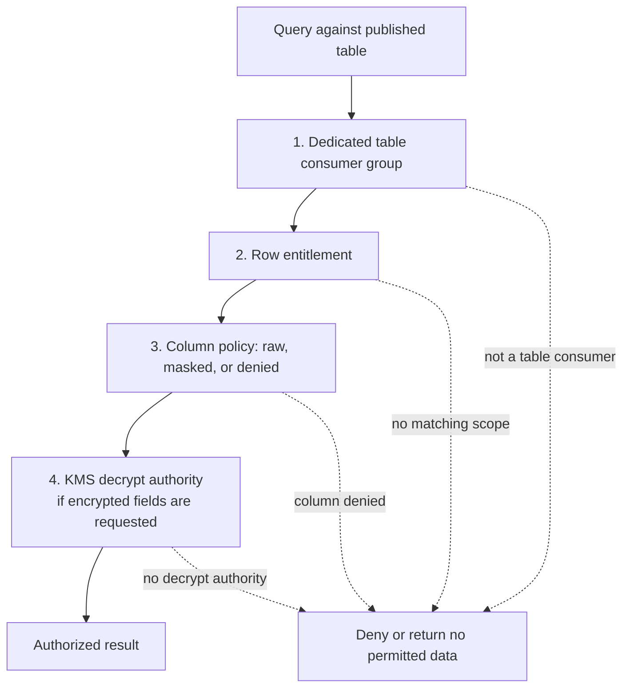
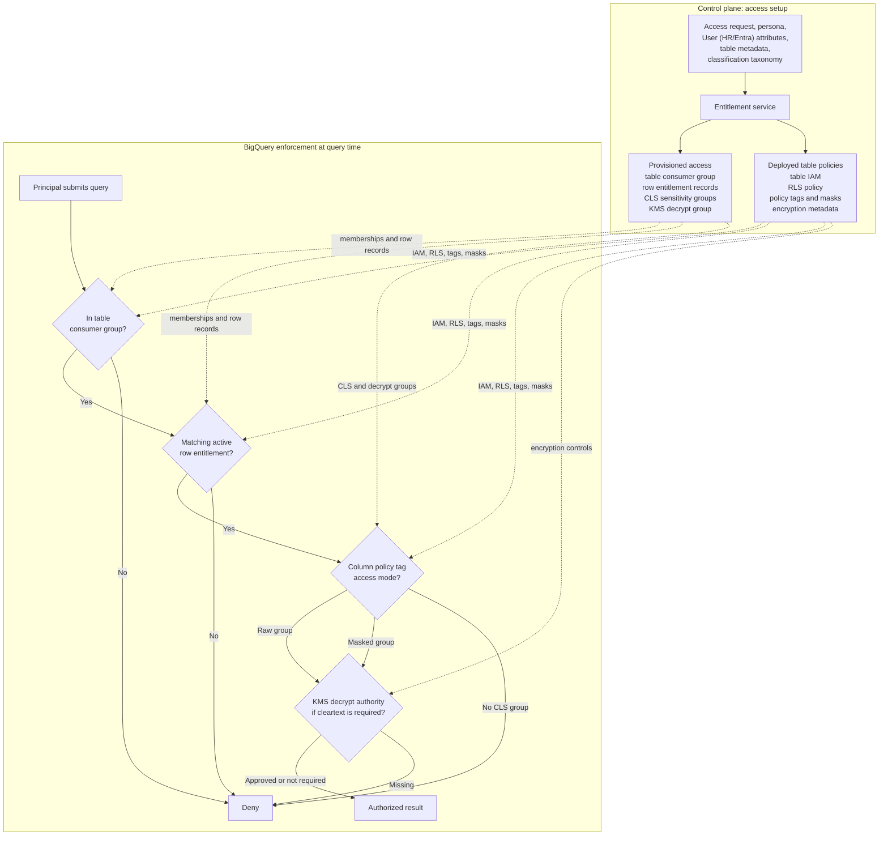

# Lakehouse Data Platform Security Requirements

## 1. Overview

This proposal defines a comprehensive security requirements model for the QXO lakehouse data platform on Google Cloud. It expands the published-data security model into a full platform security architecture covering storage, compute, service accounts, producers, developers, consumers, environment isolation, encryption, entitlement automation, audit, testing, and operational governance.

The model is built on these core decisions:

- Dev, UAT, and prod are independent security boundaries. Access configuration must not inherit across environments.
- Every published output table has a dedicated consumer group for explicit low level access grants. 
- Consumers have no access to internal data product implementation resources - example ingest or staging layers
- Developers/producer access are isolated to the data products they work on. They have full read to internal product level resources, but write and execute actions must run through approved service accounts.
- BigQuery enforces published table access through table IAM, row-level security, column-level security, masking, and encryption controls.
- Highly sensitive fields use cryptographic separation through customer-managed Cloud KMS keys and BigQuery AEAD envelope encryption where masking and policy tags are not sufficient.
- A centralized access management service translates HR, Entra, approval, and data product metadata into low-level grants and revokes.
- The publishing pipeline enforces security-as-code so every published output table has a declared, testable security contract.

BigQuery, GCS, Composer, Dataproc, dbt Cloud, and CI/CD tools are enforcement surfaces. They should not interpret raw job titles or informal access intent. The platform should use governed personas, data product metadata, environment boundaries, and approval workflows to calculate access before applying it to Google Cloud resources.

## 2. Key Outcomes

The security model must:

- Enforce least privilege for humans, service accounts, BI tools, applications, platform and product teams
- Protect storage & compute components, metadata, logs, secrets, code artifacts, and published analytical outputs.
- Separate consumer access from producer/developer access.
- Keep dev, UAT, and prod access configurations independent.
- Require a dedicated consumer group for every published output table.
- Enforce row-level business scoping such as company, region, market, branch, account, supplier, or reporting hierarchy.
- Enforce column-level sensitivity controls using centrally governed classifications, policy tags, data masking, and raw/masked/denied outcomes.
- Apply customer-managed encryption keys and field-level envelope encryption for highly sensitive/confidential data.
- Automate access deployment, entitlement reconciliation, validation, audit evidence, and revocation.
- Fail closed when required metadata, controls, identities, groups, policy tags, KMS keys, or tests are missing.
- Explain why a principal could access a component, table, row scope, sensitive field, or decrypt operation.

## 3. Non-Goals

This proposal does not:

- Make BigQuery the authority for identity, HR hierarchy, job titles, or access approvals.
- Treat catalog visibility as permission to read data.
- Use product-level consumer groups. Access fine grained at output table level.
- Treat CMEK as a replacement for table, row, column, masking, or decrypt authorization.
- Grant unrestricted production access to data engineers, developers, or support users by default.
- Expose internal product buckets, datasets, dbt jobs, Airflow controls, CI/CD assets, or pipeline logs to consumers.
- Let individual data products define their own sensitivity taxonomy outside central governance.
- Permit shared application service accounts to bypass user-level authorization.

## 4. Platform Security Architecture

The lakehouse security architecture has three planes.

| Plane | Purpose | Representative Components |
| --- | --- | --- |
| Control plane | Defines desired access, classifications, approvals, policies, personas, and security metadata | Access management service, entitlement resolver, data product registry, classification taxonomy, policy-as-code, audit ledger |
| Data plane | Stores and processes lakehouse data | GCS buckets, BigQuery datasets and tables, Dataproc workloads, dbt transformations |
| Consumption plane | Provides human, BI, application, and operational access to approved outputs | BigQuery published tables, governed views, BI tools, operational APIs, approved extracts |

Layered access decision:



### 4.1 Published Data Access Setup and Enforcement

Published data access is provisioned as separate, composable grants. The table consumer group controls whether a principal can read a specific published table. Row entitlements control which business content within that table is visible. CLS sensitivity groups control how tagged sensitive columns are returned: raw, masked, or denied. These grants are intentionally independent, and BigQuery enforces the intersection at query time.



Access should be read as an intersection, not as a hierarchy where one grant overrides the others:

```text
Effective published data access =
  Membership in the table's dedicated consumer group
  AND matching RLS entitlement when row security is required
  AND CLS treatment for each protected column
  AND KMS or wrapped-keyset decrypt authority where encrypted cleartext is requested
```

The two primary group families have different purposes:

| Group family | Scope | Controls | Requirement |
| --- | --- | --- | --- |
| Table consumer group | One environment-specific published table | Table IAM and the RLS policy grant target | Required for every published output table |
| CLS sensitivity group | One environment-specific classification and treatment, shared across tables | Policy-tag raw access or masking data policy access | Required for every enforced sensitive classification |

This separation prevents broad sensitivity membership from becoming broad data access. A principal in `bq-prod-cls-personal-identifier-raw@qxo.com` can see raw PII only in tables they are already entitled to consume and only for rows allowed by RLS. A principal in a table consumer group without a matching CLS group can query unprotected columns but receives masked values or access denial for protected columns based on the configured data policy.

There are two automation paths:

- **Resource deployment:** triggered when a data product, bucket, dataset, table, DAG, job, service account, or schema is created or changed.
- **Identity lifecycle:** triggered when a person, service account, role, approval, exception, contractor status, or organizational assignment changes.

These paths must remain separate. A table deployment should not require rewriting every user entitlement, and a user move should not require redeploying every table.

## 5. Access Surfaces

### 5.1 Storage Components

The platform must control access to the following storage resources.

| Storage Component | Primary Access Pattern | Required Controls |
| --- | --- | --- |
| GCS source-aligned buckets | Ingestion and controlled producer access | Environment-specific IAM, service account writes, CMEK where required, retention policy, object lifecycle, audit logs |
| GCS data product buckets | Product-owned intermediate artifacts, extracts, dbt artifacts, job outputs | Product-scoped IAM, no consumer access by default, environment-specific service accounts, CMEK for sensitive products |
| Shared code, library, and CI/CD buckets | Platform artifacts and reusable packages | Platform-controlled write access, read access only for approved build/runtime service accounts, artifact integrity controls |
| BigQuery ingest datasets | Raw or landing-zone structured data | Product/platform service account access, restricted human read access, no consumer access |
| BigQuery staging datasets | Transformation and validation data | Product-scoped developer read, service account write, no consumer access |
| BigQuery publish datasets | Governed published outputs | Dedicated table consumer groups, RLS, CLS, masking, CMEK, optional field envelope encryption |

### 5.2 Compute Components

The platform must control access to the following compute and operational surfaces.

| Compute Component | Primary Access Pattern | Required Controls |
| --- | --- | --- |
| Airflow / Composer UI | Pipeline monitoring and controlled operations | Environment-specific groups, read-only for support where possible, production break-glass for mutation |
| Composer logs | Troubleshooting and audit | Environment-specific log access, redaction controls, no sensitive values in logs |
| Dataproc logs | Job debugging and production support | Product/environment-scoped access, sensitive log review, no consumer access |
| dbt Cloud | Development, transformation, deployment | Environment-specific roles, separation between developer actions and production execution service accounts |
| CI/CD runners | Deployment automation | Dedicated deployment service accounts, no routine data-reader access, approval gates for production |

### 5.3 Security Metadata Stores

The platform must manage security metadata as sensitive control-plane data. These are the authoritative source for access decisions, classification rules, encryption mappings, approvals, exceptions, and deployment evidence used by platform automation. They must be managed through governed workflows with environment-specific ownership, restricted write access, audit logging, validation controls, and change approval before metadata is applied to GCP resources.

Required security metadata stores:

- Resource registry. Governed GCP projects, datasets, tables, buckets, service accounts, keys, and operational resources.
- Data product registry. Product owner, domain, environment, lifecycle state, support model, and linked resources.
- Published output table registry. Table owner, consumer group, classification profile, row controls, column controls, and publication status.
- Principal entitlement ledger. Approved access scope, reason, approver, effective dates, expiration, and revocation status.
- Persona registry. Standard access personas and entitlement patterns, separate from raw job titles.
- Row entitlement tables. Business-scope access by company, region, market, branch, account, supplier, or hierarchy.
- Classification taxonomy and policy tag registry. Sensitive data classes, BigQuery policy tags, masks, raw access groups, and deny outcomes.
- KMS key and wrapped keyset registry. KMS keys, wrapped keysets, encrypted field mappings, owners, rotation state, and decrypt authority.
- Approval, exception, and certification records. Access approvals, exception justifications, production permissions, and periodic review evidence.
- Deployment evidence and validation results. Deployed controls, executed tests, validation outcomes, and promotion-blocking failures.

## 6. Access Principals and Groups

### 6.1 Principal Types

The access model must support:

- Human users.
- External users.
- Terraform service accounts.
- Witboost technical adapter service accounts.
- Composer service accounts.
- Data product service accounts.
- Dataproc service accounts.
- dbt Cloud service accounts.
- CI/CD deployment service accounts.
- BI and application service accounts.
- Break-glass identities.

Each principal must have an owner, environment boundary, purpose, approval path, and revocation path.

### 6.2 Standard Group Types

The platform should use the following group categories.

| Group Type | Purpose |
| --- | --- |
| Data Platform Support Group | Platform operations, monitoring, troubleshooting, and controlled production support |
| Data Product Support Group | Support access for a specific data product |
| Data Product Developer Group | Read-oriented development access to product internals and development tooling |
| Data Product Consumer Group | Table-level read access to one published output table |
| Sensitivity Access Group | Raw or masked access to centrally governed sensitive classifications |
| KMS Decrypt Group | Approved decrypt authority for field-level encrypted data |
| Platform Full-Access Group | Tightly controlled service accounts or support identities requiring full row scope |

Human users and service accounts should not be mixed casually in the same groups. Service account membership in human groups must be rejected unless explicitly approved.

### 6.3 Environment-Specific Groups

All groups must be environment-specific. Dev, UAT, and prod groups must be separate even when the data product, table, or persona name is otherwise identical.

Required naming pattern:

```text
bq-{env}-{domain}-{table}-consumer@qxo.com
bq-{env}-{domain}-platform-full-access@qxo.com
bq-{env}-cls-{classification}-{mode}@qxo.com
bq-{env}-kms-{classification}-decrypt@qxo.com
dp-{env}-{domain}-{product}-developer@qxo.com
dp-{env}-{domain}-{product}-support@qxo.com
```

Examples:

```text
bq-dev-sales-order-fact-consumer@qxo.com
bq-uat-sales-order-fact-consumer@qxo.com
bq-prod-sales-order-fact-consumer@qxo.com
dp-prod-sales-order-analytics-developer@qxo.com
```

## 7. Environment Isolation Requirements

Dev, UAT, and prod must have independent access configurations. Access in one environment must not imply, inherit, or automatically create access in another environment.

This applies to:

- Projects.
- Datasets.
- GCS buckets.
- Published output table consumer groups.
- Developer and support groups.
- Row entitlement records.
- Sensitivity access groups.
- Platform full-access groups.
- KMS key rings and keys.
- Wrapped keysets.
- Service accounts.
- BI connections.
- Airflow/Composer environments.
- Dataproc clusters and jobs.
- dbt Cloud environments.
- CI/CD deployment credentials.
- Validation test identities.

Promotion from dev to UAT to prod promotes metadata, code, policy definitions, and tested configuration patterns. It must not promote user membership, service account grants, KMS decrypt grants, or row entitlement records unless a separate environment-specific approval exists.

Production access requires a separate approval and certification path. A user approved for dev testing is not automatically approved for UAT or prod. A UAT service account is not automatically approved for production operations.

## 8. Producer and Developer Access Requirements

Producers and developers are restricted to the data products they work on.

### 8.1 Data Product Developer Access

Developers may need visibility into internal data product resources to build, debug, and validate pipelines. The default pattern is:

- Read access to assigned data product buckets.
- Read access to assigned ingest and staging datasets where approved.
- Read access to published outputs for the same data product where approved.
- Read access to relevant Composer, Dataproc, dbt, and CI/CD logs.
- No direct production write or execute permissions by default.
- No direct mutation of production BigQuery tables, GCS buckets, Airflow DAG runs, Dataproc jobs, or deployment state.

Production writes, transformations, and deployments must run through approved service accounts and controlled pipelines.

### 8.2 Production Break-Glass

Production break-glass access must be:

- Time-bound.
- Approved by data product owner and platform/security approver where required.
- Logged before use where possible.
- Monitored during use where possible.
- Reviewed after use.
- Removed automatically at expiration.

UAT may allow more relaxed support access than production, but it must still be explicitly granted and environment-scoped. UAT access must not become a path to production access.

### 8.3 Service Account Execution Model

Service accounts should execute privileged operations on behalf of controlled workflows.

| Service Account | Intended Use | Requirement |
| --- | --- | --- |
| Terraform SA | Provision infrastructure and IAM | Deployment-only permissions, environment-specific, approval-gated production changes |
| Witboost Technical Adapter SA | Scaffold and deploy platform/data product resources | Least privilege to required APIs, no broad human data-reader role |
| Composer SA | Orchestrate workflows | Prefer impersonation of workload-specific service accounts |
| Data Product SA | Execute product pipelines | Product/environment-scoped read/write access |
| dbt Cloud SA | Run dbt jobs | Environment-specific roles, controlled target schemas |
| Dataproc SA | Execute distributed processing | Product-scoped data access and workload-specific permissions |
| BI/Application SA | Query published outputs | Documented query identity model and fixed persona where end-user identity is not propagated |

## 9. Consumer Access Requirements

Consumers should access governed published outputs only. They must not receive access to internal implementation resources.

Consumer access must not include:

- Source-aligned GCS buckets.
- Data product internal GCS buckets.
- BigQuery ingest datasets.
- BigQuery staging datasets.
- Airflow DAG code or mutation rights.
- Composer or Dataproc logs unless separately approved.
- dbt Cloud development or deployment permissions.
- CI/CD artifacts or deployment credentials.

Consumer access is granted through the published data access stack:

```text
Effective access = Query execution permission
                AND environment-specific table entitlement
                AND row entitlement
                AND column entitlement
                AND decrypt entitlement where applicable
```

## 10. Published BigQuery Access Model

### 10.1 Query Execution

A user or workload needs permission to create a BigQuery query job in an approved project. This is normally:

```text
roles/bigquery.jobUser
```

This permission should be granted on approved query or billing projects. It does not grant access to table data.

### 10.2 Dedicated Consumer Group Per Published Output Table

Every published output table must have a dedicated consumer group. This is a required control.

| Item | Example |
| --- | --- |
| Table | `qxo-lakehouse-prod.sales_publish.sales_order_fact` |
| Consumer group | `bq-prod-sales-order-fact-consumer@qxo.com` |
| BigQuery role | `roles/bigquery.dataViewer` |
| Scope | Table-level IAM binding |

Product-level consumer groups are not permitted for published output table access. The entitlement service may assign a persona to multiple table groups, but the deployed authorization boundary remains one group per published output table.

Required controls:

- A dedicated group must exist for every published output table in every environment.
- The group must be traceable to environment, domain, data product, and table.
- The group must be granted `roles/bigquery.dataViewer` only on that table unless an explicit exception is approved.
- Group ownership must include business and technical owners.
- Membership changes must be driven by the entitlement process.
- Membership must be certified independently per table and environment.
- Group cleanup must be automated when tables are retired.

### 10.3 Row-Level Security

Row-level access limits a table consumer to authorized business scope, such as company, legal entity, region, market, price zone, branch, customer account, supplier, or reporting hierarchy.

The platform must use centralized entitlement records rather than user-specific row access policies.

Recommended row entitlement columns:

```text
principal_id
principal_type
principal_email
environment
domain_name
data_product_name
resource_name
scope_type
scope_value
source_system
source_rule_id
approval_id
valid_from
valid_through
is_active
calculated_at
```

Example RLS policy:

```sql
CREATE OR REPLACE ROW ACCESS POLICY dynamic_sales_scope
ON `qxo-lakehouse-prod.sales_publish.sales_order_fact`
GRANT TO (
  'group:bq-prod-sales-order-fact-consumer@qxo.com'
)
FILTER USING (
  EXISTS (
    SELECT 1
    FROM `qxo-security-prod.entitlements.user_row_entitlement` e
    WHERE LOWER(e.principal_email) = LOWER(SESSION_USER())
      AND e.environment = 'prod'
      AND e.data_product_name = 'sales'
      AND e.resource_name = 'sales_order_fact'
      AND e.is_active
      AND CURRENT_DATE() BETWEEN e.valid_from AND e.valid_through
      AND (
        e.scope_type = 'all'
        OR (e.scope_type = 'region' AND e.scope_value = region_code)
        OR (e.scope_type = 'branch' AND e.scope_value = branch_number)
      )
  )
);
```

Platform full-row access must be isolated in a separate group:

```sql
CREATE OR REPLACE ROW ACCESS POLICY platform_full_access
ON `qxo-lakehouse-prod.sales_publish.sales_order_fact`
GRANT TO (
  'group:bq-prod-sales-platform-full-access@qxo.com'
)
FILTER USING (TRUE);
```

Full-access groups must be small, separately approved, monitored, and certified more frequently. Multiple RLS policies combine permissively; a full-access policy effectively overrides filtered row access for matching principals.

### 10.4 Column-Level Security and Masking

Column access must use centrally governed classifications and BigQuery policy tags.

Example taxonomy:

```text
qxo_data_classification
|-- public
|-- internal
|-- confidential
|   |-- personal_identifier
|   |-- customer_pii
|   |-- supplier_pii
|   `-- personal_compensation
`-- restricted
    |-- government_identifier
    |-- financial_account
    |-- authentication_secret
    `-- regulated_health
```

For each enforced classification, QXO must define:

- Raw access group.
- Masked access group where appropriate.
- Denied behavior where access is not legitimate.
- BigQuery policy tag.
- Data masking policy.
- Data owner.
- Approval workflow.
- Recertification frequency.

Example groups:

```text
bq-prod-cls-personal-identifier-raw@qxo.com
bq-prod-cls-personal-identifier-masked@qxo.com
bq-prod-cls-compensation-raw@qxo.com
bq-prod-cls-financial-account-raw@qxo.com
```

Column outcomes:

| Outcome | Meaning |
| --- | --- |
| Raw | Principal can see the stored value |
| Masked | Principal can query the column but receives a transformed value |
| Denied | Query referencing the column fails |

Consumers should use explicit column lists in production workloads. `SELECT *` can fail when protected columns are denied, which is safer than silently dropping restricted data.

## 11. Encryption Requirements

Encryption is a complementary protection layer. It does not replace IAM, RLS, CLS, or masking.

### 11.1 CMEK

Customer-managed Cloud KMS keys must be used for restricted BigQuery datasets, tables, and persisted query outputs where required by classification.

Recommended scopes:

| Scope | Use |
| --- | --- |
| Project default CMEK | Restricted analytics projects where all BigQuery resources require customer-managed keys |
| Dataset default CMEK | Sensitive data products where tables share a key boundary |
| Table-level CMEK | Exceptional tables requiring a distinct key boundary |
| Destination CMEK | Persisted query outputs, extracts, and derived restricted datasets |

CMEK controls key custody, auditability, lifecycle, and crypto-shredding options. It is not user-level access control. If the BigQuery service account can decrypt the storage key, users with authorized BigQuery access can query the table according to BigQuery policies.

### 11.2 Column-Level Envelope Encryption

Highest-risk fields must use BigQuery AEAD envelope encryption with Cloud KMS-wrapped keysets when policy tags and masking are not sufficient.

Candidate fields:

- Social Security numbers.
- Tax identifiers.
- Bank account numbers.
- Payroll account identifiers.
- Regulated credentials or tokens.
- Data elements requiring crypto-shredding or dual-control access.

The pattern is:

- A data encryption key encrypts the column value.
- The data encryption key is stored as a wrapped keyset.
- The wrapped keyset is encrypted by a Cloud KMS customer-managed key.
- Decryption requires access to the BigQuery data, the wrapped keyset, and the Cloud KMS key.

Example:

```sql
SELECT
  DETERMINISTIC_DECRYPT_STRING(
    KEYS.KEYSET_CHAIN(@kms_resource_name, @wrapped_keyset),
    bank_account_number_encrypted,
    CAST(customer_id AS STRING)
  ) AS bank_account_number
FROM `qxo-lakehouse-prod.sales_publish.customer_payment_dim`;
```

Deterministic encryption should be used only when equality matching, joining, or deduplication is required. Non-deterministic encryption should be the default for fields decrypted only for controlled display or operational use.

### 11.3 Key Management

KMS controls must be environment-specific.

Requirements:

- Dev, UAT, and prod must use separate key rings, keys, and wrapped keysets.
- Prod keys must not grant decrypt permissions to dev or UAT service accounts.
- Keys must be in the same region or multi-region as the BigQuery dataset or query execution location.
- KMS IAM must be tightly controlled and separated from ordinary BigQuery table access.
- Key administrators must be separate from data consumers.
- Rotation, rewrap, disablement, and destruction procedures must be documented.
- Break-glass decrypt access must be time-bound and reviewed after use.

## 12. Access Management Service

QXO should implement a centralized access management service using the chosen workflow platform, such as SailPoint, Saviant, Cortex, Witboost, or an equivalent internal service.

The service has two responsibilities:

- **Access workflow:** request, approval, exception, certification, and revocation.
- **Access resolver:** translation of high-level access requests into low-level grants and revokes.

### 12.1 Inputs

Inputs include:

- Workday employment status, worker type, job family, manager, region, branch, company, and assignment.
- Entra users, groups, app roles, and service principals.
- Data product registry.
- Published output table registry.
- Classification taxonomy.
- Row-scope source data.
- Approved access requests.
- Training or attestation status.
- Exceptions and break-glass approvals.

### 12.2 Outputs

Outputs include:

- Add/remove users or service accounts from dedicated table consumer groups.
- Add/remove users or service accounts from developer, support, and platform groups.
- Add/remove users or service accounts from sensitivity groups.
- Add/remove KMS decrypt grants for approved field-level decrypt use cases.
- Insert/update/remove row entitlement records.
- Record audit evidence and validation state.

### 12.3 Normalized Personas

Raw job titles are not sufficient authorization controls. The service must map authoritative attributes and approvals into normalized access personas.

Example personas:

| Persona | Typical Qualifying Facts | Table Profile | Row Rule | Sensitivity Ceiling | Decrypt Profile |
| --- | --- | --- | --- | --- | --- |
| `branch_sales_rep` | Active sales employee assigned to branch | Assigned operational sales outputs | Assigned branch | Internal | None |
| `branch_manager` | Approved manager with branch hierarchy | Sales and AR outputs | Managed branches | PII masked | None |
| `regional_sales_manager` | Approved regional leader | Sales and AR outputs | Managed region | PII raw where approved | None by default |
| `pricing_analyst` | Pricing function and market assignment | Pricing/product outputs | Assigned markets | Confidential pricing | Tokenized values preferred |
| `ar_collections_analyst` | AR function and company assignment | AR/customer outputs | Assigned companies | Selected financial data | By exception |
| `data_product_developer` | Assigned to product team | Product internals and outputs | Product-specific | Limited sensitive data | None by default |
| `platform_operator` | Approved support function | Operational support resources | Explicit full scope | Workload-required | Just-in-time where needed |

### 12.4 Access Management Events

| Event | Required Behavior |
| --- | --- |
| Joiner | Provision only approved persona-derived access after required approvals |
| Mover | Remove obsolete access and add only approved new access |
| Leaver | Disable interactive access, remove group memberships, close exceptions, revoke sessions where possible |
| Contractor expiration | Remove access unless renewal is explicitly approved |
| Exception expiration | Automatically remove exception-derived grants |
| Service account retirement | Remove IAM, group membership, key access, and workload bindings |

Provisioning states:

```text
Requested -> Approved -> Provisioned -> Propagating -> Verified -> Certified
```

Only `Verified` access should be reported as usable.

## 13. Security Metadata Contract

Every data product and published output table must declare security metadata as code. The metadata should be reviewed, versioned, validated by CI/CD, and applied by the platform.

Example:

```yaml
version: 1

tables:
  - name: sales_order_fact
    environment: prod
    domain: sales
    product: order_analytics
    owner_group: dp-prod-sales-order-analytics-owner@qxo.com

    access:
      default: deny
      consumer_group: bq-prod-sales-order-fact-consumer@qxo.com
      platform_full_access_group: bq-prod-sales-platform-full-access@qxo.com

    encryption:
      cmek_required: true
      kms_key_name: projects/qxo-kms-prod/locations/us/keyRings/prod-restricted-us/cryptoKeys/sales-restricted
      encrypt_query_outputs: true

    row_security:
      required: true
      policy_name: dynamic_sales_scope
      entitlement_resource: sales_order_fact
      dimensions:
        - scope_type: company
          column: company_code
        - scope_type: region
          column: region_code
        - scope_type: branch
          column: branch_number

    columns:
      - name: order_number
        classification: internal

      - name: customer_email
        classification: personal_identifier
        treatment: mask_unless_raw_authorized

      - name: credit_limit
        classification: confidential_commercial
        treatment: deny_unless_authorized

      - name: bank_account_number
        classification: restricted_financial_account
        treatment: deny_unless_authorized
        encrypted: true
        encryption_mode: non_deterministic
        kms_key_name: projects/qxo-kms-prod/locations/us/keyRings/prod-payment-us/cryptoKeys/payment-field-encryption
        wrapped_keyset_ref: qxo-security-prod.crypto_keysets.payment_field_keyset
        additional_authenticated_data:
          - customer_id
```

### 13.1 Required Validations

The pipeline must reject publication when:

- Environment is missing or invalid.
- Consumer group is missing, shared, or belongs to another environment.
- Owner or approver is missing.
- Required RLS metadata is missing.
- RLS columns do not exist or have incompatible types.
- Sensitive columns have no recognized classification or policy tag.
- Required masking policy does not exist.
- CMEK is required but missing.
- Encrypted fields lack encryption mode, KMS key, wrapped keyset reference, or additional authenticated data.
- KMS keys or wrapped keysets belong to the wrong environment.
- Full-access group equals the consumer group.
- Service accounts are hidden inside human consumer groups.
- A broad project or dataset grant would bypass table-level intent.
- A proposed declassification lacks elevated review.

## 14. BI, Application, and Shared Identity Requirements

The querying identity determines what BigQuery can enforce.

If a BI tool or application queries BigQuery through a shared service account, BigQuery evaluates table access, RLS, CLS, and decrypt authority for that service account rather than for the human user.

Approved patterns:

| Pattern | Requirement |
| --- | --- |
| End-user identity propagation | Preferred where supported; BigQuery policies apply to the human user |
| Approved service-account persona | Application service account receives fixed table, row, column, and decrypt scope; application enforces finer user authorization |
| Curated data interface | Application uses governed views, APIs, extracts, or serving tables containing only approved data |

Every consuming application must record:

- Effective BigQuery identity.
- Environment.
- Approved tables.
- Row scope.
- Sensitive-column treatment.
- Decrypt authority, if any.
- Whether end-user identity is preserved.
- Application owner and certification frequency.

Shared BI service accounts must be separate for dev, UAT, and prod and must not receive field-level decrypt permissions unless the BI platform is formally approved as a user-level enforcement layer.

## 15. Audit, Monitoring, and Certification

### 15.1 Audit Evidence

For each access decision, QXO must be able to answer:

- Who requested access?
- Who approved access?
- Which environment did it apply to?
- Which principal received access?
- Which identity actually queried BigQuery or accessed GCS?
- Which table group, developer group, support group, sensitivity group, or KMS grant permitted access?
- Which row scopes were assigned?
- Which sensitive-column treatment was applied?
- Which persona, source attributes, and approval produced the entitlement?
- When does access expire?
- When was it last certified?
- What validation proved the access worked as intended?

### 15.2 Monitoring Signals

Recommended monitoring signals:

- Denied BigQuery table access.
- Queries affected by RLS.
- Protected-column access denials.
- Raw access to restricted tags.
- KMS decrypt operations for encrypted fields.
- GCS object reads from restricted buckets.
- Composer, Dataproc, and dbt production mutation events.
- Changes to policy tags, masking policies, RLS policies, table IAM, bucket IAM, and KMS IAM.
- Additions to platform full-access groups.
- Service accounts used interactively.
- Shared service accounts used where end-user attribution is expected.
- Cross-environment principal, group, service account, or KMS usage.
- Stale identity synchronization.
- Expired entitlements still present in target systems.

### 15.3 Certification Frequency

| Access Type | Review Frequency |
| --- | --- |
| Published output table consumer access | Semiannual or annual based on risk |
| Confidential raw data | Quarterly |
| Restricted raw data | Monthly or quarterly based on policy |
| Field-level decrypt access | Quarterly or more frequently for regulated data |
| Platform full-row access | Quarterly |
| Production break-glass | After every use and monthly membership check |
| Contractor access | At expiration and at least quarterly |
| Developer access to production internals | Quarterly |
| Dev, UAT, and prod access | Certified separately |

## 16. Testing Requirements

Security tests must validate combined behavior, not just individual controls.

### 16.1 Required Persona Tests

| Test Identity | Expected Result |
| --- | --- |
| Unauthorized user | No table or internal platform access |
| Consumer with no row entitlement | Table is recognized but no permitted rows are returned, or access is denied according to policy |
| Branch consumer | Assigned branch rows only; internal columns only |
| Regional manager | Assigned region rows only; approved raw or masked columns |
| Masked analyst | Approved row scope with masked sensitive fields |
| Restricted-data user | Approved row scope with selected restricted columns raw |
| User with table, row, and column access but no KMS decrypt | Ciphertext only or decrypt failure |
| Data product developer | Product-scoped internal read access; no direct production write/execute |
| Platform pipeline SA | Workload-required full scope only |
| Shared BI SA | Fixed approved scope according to documented application model |
| Dev-only user | No UAT or prod access |
| UAT-only user | No prod access |
| Terminated user | Denied everywhere |

### 16.2 Structural CI Tests

The platform must assert:

- Every published table has an owner and dedicated environment-specific consumer group.
- Table IAM matches approved desired state.
- No broad consumer grants exist at project or dataset level.
- RLS exists when required.
- Full-access and filtered groups are different.
- Row dimensions exist and are type-compatible.
- Every protected column has the correct classification and policy tag.
- Required masking policies exist.
- CMEK configuration matches classification and environment.
- Encrypted-column metadata is complete.
- KMS keys and wrapped keysets match the target environment.
- Service accounts are not hidden in human consumer groups.
- Consumer groups do not grant internal bucket, ingest dataset, staging dataset, log, dbt, Airflow, or CI/CD access.

### 16.3 Behavioral Tests

Behavioral tests should run as representative identities and assert:

- Unauthorized rows are not returned.
- Unauthorized columns are denied or masked.
- Encrypted fields are not decrypted without KMS authority.
- Decrypted results cannot be written to uncontrolled destinations.
- CMEK-protected outputs use the correct key.
- Dev access does not grant UAT or prod access.
- UAT access does not grant prod access.
- Shared service accounts cannot cross environment boundaries.
- Joiner, mover, leaver, contractor expiration, and exception expiration behavior works.

## 17. Failure Handling

The platform must fail closed.

| Failure | Required Behavior |
| --- | --- |
| Missing table consumer group | Do not publish table |
| Missing owner or approver | Do not publish table |
| Unknown persona | Grant no new access and raise review item |
| Missing RLS entitlement | Return no permitted rows or deny according to policy |
| Missing sensitivity tag | Block publication when classification is required |
| Tag exists but enforcement policy is missing | Block publication |
| CMEK key missing or wrong environment | Block deployment |
| KMS key unavailable | Stop affected writes/reads where required and alert operator |
| Entitlement feed stale | Stop additions, remove expired access, alert operator |
| Group update pending | Show propagating state, not ready |
| Access verification fails | Roll back or leave resource unpublished |
| Shared application identity undocumented | Deny production onboarding |
| Cross-environment grant detected | Remove or quarantine grant and open incident/review |

## 18. Risks and Mitigations

| Risk | Impact | Mitigation |
| --- | --- | --- |
| Cross-environment access leakage | Dev or UAT access reaches prod, or prod credentials are reused in lower environments | Separate groups, service accounts, entitlement records, policy tags, KMS keys, wrapped keysets, BI connections, and validation tests per environment |
| One group per output table creates operational volume | Certification and lifecycle burden | Deterministic automation, registry ownership, reconciliation, certification evidence, and cleanup |
| Job title maps directly to access | Overgranting after reorganizations or acquisitions | Normalize to governed personas and require approval controls |
| Shared BI service account hides human identity | Human-specific RLS, CLS, and decrypt controls do not apply | Preserve end-user identity, assign fixed application persona, or use curated interface |
| Dataset/project grant bypasses table intent | User reads tables without table consumer group | Detect and prohibit broad consumer data grants |
| Multiple RLS policies overlap | Rows combine through permissive OR behavior | Prefer one dynamic policy plus tightly controlled full-access policy |
| Missing classification on new column | Sensitive data exposed | Classification gate and schema scanning before publication |
| CMEK mistaken for user-level authorization | Users may assume KMS replaces RLS/CLS | State that CMEK controls key custody; use field envelope encryption for cryptographic separation |
| KMS key disabled or unavailable | Reads, writes, extracts, or streaming persistence may fail | Monitor key health, protect KMS IAM, require change approvals, and test failure procedures |
| Decrypted values written downstream | Cleartext escapes protected boundary | Require destination CMEK, policy tags, RLS, export controls, and tests for decrypting jobs |
| Deterministic encryption leaks equality patterns | Sensitive identifiers can be correlated | Use non-deterministic encryption by default; document deterministic exceptions |
| Logs contain sensitive data | Sensitive values exposed through operational access | Redact logs, restrict log access, and test logging behavior |
| Platform operators receive excessive access | Large production blast radius | Workload-specific SAs, just-in-time support, break-glass review, and frequent certification |

## 19. Implementation Roadmap

### Phase 1: Foundation

- Approve the classification taxonomy.
- Define environment isolation standards.
- Define per-table consumer group naming and ownership standards.
- Define producer, developer, consumer, support, and platform group standards.
- Define normalized access personas.
- Establish resource, entitlement, classification, KMS, and audit registries.
- Prohibit broad production consumer grants at project and dataset level.

### Phase 2: Platform Access Baseline

- Apply environment-specific IAM to GCS buckets, BigQuery datasets, Composer, Dataproc, dbt Cloud, and CI/CD.
- Separate human and service account access.
- Implement production break-glass process.
- Establish service account execution and impersonation patterns.

### Phase 3: Published Data Controls

- Implement dedicated consumer groups for each published output table.
- Deploy table IAM, RLS, policy tags, masking policies, CMEK, and encrypted field metadata.
- Build structural CI validation and fail-closed publication gates.

### Phase 4: Entitlement Automation

- Build the access management workflow and access resolver.
- Integrate Workday, Entra, data product registry, and approval sources.
- Automate group membership, row entitlement records, sensitivity group membership, and KMS decrypt grants.
- Implement joiner, mover, leaver, contractor, exception, and service account lifecycle.

### Phase 5: Consumer and Application Onboarding

- Register BI and application query identity models.
- Prefer end-user identity propagation.
- Assign fixed service account personas only after formal review.
- Validate each consumer against positive and negative tests.

### Phase 6: Continuous Assurance

- Automate drift detection across IAM, groups, RLS, CLS, masking, CMEK, KMS IAM, wrapped keysets, and service accounts.
- Produce certification evidence.
- Monitor cross-environment access attempts.
- Track exception aging and break-glass use.
- Report control coverage by data product and environment.

## 20. Security Review Decisions Requested

The architecture security group is asked to approve:

1. Dev, UAT, and prod must have independent access configurations with no inherited access.
2. Every published output table must have a dedicated environment-specific consumer group.
3. Consumers must not access internal data product buckets, ingest datasets, staging datasets, pipeline logs, dbt projects, Airflow controls, or CI/CD resources unless separately approved.
4. Producers and developers are restricted to assigned data products and do not receive direct production write/execute access by default.
5. Production privileged actions must run through approved service accounts, controlled pipelines, or break-glass.
6. BigQuery table IAM, RLS, CLS, masking, CMEK, and field envelope encryption form the published-data enforcement stack.
7. Row-level security will use centralized entitlement records rather than per-user row policies.
8. Column-level security will use centrally governed classifications and sensitivity groups.
9. Highest-risk fields requiring cryptographic separation must use BigQuery AEAD envelope encryption with Cloud KMS-wrapped keysets.
10. KMS decrypt access must be governed, approved, audited, and certified separately from BigQuery table access.
11. A centralized access management service will translate HR, Entra, approval, and data product metadata into low-level grants and revokes.
12. The publishing pipeline must block release when security metadata or validation is incomplete.
13. Shared service account consumption patterns must receive explicit architecture review.
14. Access certification and audit evidence must be produced separately by environment.

## 21. Definition of Done

A data product or published output is security-complete only when:

- Environment is declared and validated.
- Owners and approvers are registered.
- Internal buckets, ingest datasets, staging datasets, logs, and compute controls are restricted to approved producer, developer, support, and service account groups.
- Consumers have access only through published output controls.
- Every published output table has a dedicated consumer group.
- Table IAM matches approved desired state.
- Required RLS policies are deployed and tested.
- Row scopes are derived from governed entitlement records.
- Sensitive columns carry approved policy tags.
- Raw, masked, and denied column treatments work as designed.
- CMEK is applied where required.
- Field-level encrypted columns have complete keyset and KMS metadata.
- Human, BI, application, and service account query identities are documented.
- Dev, UAT, and prod access do not leak across environments.
- Positive and negative tests pass.
- Joiner, mover, leaver, contractor expiration, and exception expiration behavior has been tested.
- Audit evidence exists for deployment and access decisions.
- Drift monitoring is active.

## 22. Reference Documents

This proposal blends and extends the core content from:

- `security_requirements_prompt.md`
- `lh_security.md`
- `QXO_Lakehouse_Published_Data_Security_Design.md`

## 23. Google Cloud References

- BigQuery IAM for datasets, tables, views, and routines: https://cloud.google.com/bigquery/docs/control-access-to-resources-iam
- BigQuery table IAM policy API: https://cloud.google.com/bigquery/docs/reference/rest/v2/tables/setIamPolicy
- BigQuery row-level security: https://cloud.google.com/bigquery/docs/row-level-security-intro
- BigQuery row-level security best practices: https://cloud.google.com/bigquery/docs/best-practices-row-level-security
- BigQuery column-level access control: https://cloud.google.com/bigquery/docs/column-level-security-intro
- BigQuery data masking: https://cloud.google.com/bigquery/docs/column-data-masking-intro
- BigQuery customer-managed encryption keys: https://cloud.google.com/bigquery/docs/customer-managed-encryption
- BigQuery column-level encryption with Cloud KMS: https://cloud.google.com/bigquery/docs/column-key-encrypt
- BigQuery AEAD encryption concepts: https://cloud.google.com/bigquery/docs/aead-encryption-concepts
- Google Cloud IAM access-change propagation: https://cloud.google.com/iam/docs/access-change-propagation
